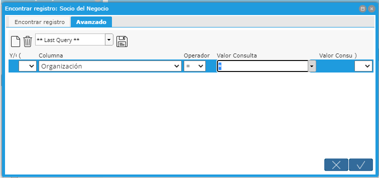
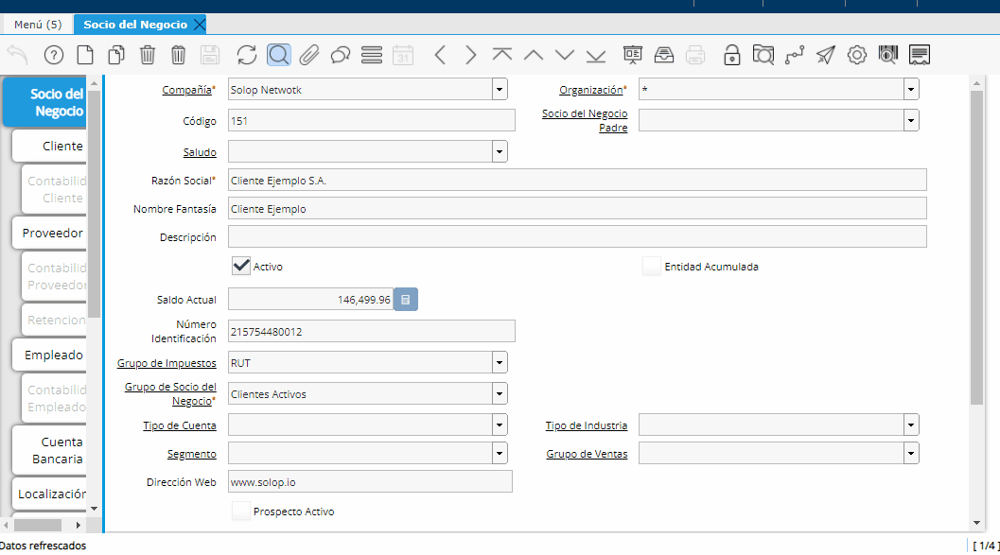

.. |Gif Borrar Filtro| image:: resources/gif-borrar-filtro.gif
.. |Gif Filtro Avanzado| image:: resources/gif-filtro-avanzado.gif

.. |Gif Modificar Filtro| image:: resources/gif-modificar-filtro.gif
.. |Seleccionar Búsqueda Guardada| image:: resources/seleccion-de-busqueda-guardada.png

Filtro Avanzado de Búsqueda
===========================

Filtro Avanzado
^^^^^^^^^^^^^^^

|Filtro Avanzado|

Usted puede también seleccionar la pestaña *Avanzado*  dentro del
dialogo de búsqueda para introducir más  criterios de búsqueda que los
predefinidos.

Todos los campos existentes para la pestaña (Tabla) están disponibles
para la búsqueda avanzada como "Columnas".

Seleccione *Columna*, *Operador* y *Valor de Consulta*. Si desea añadir
más criterios, seleccione el botón *Nuevo Registro* para añadir el
criterio adicional.

Todas las líneas serán evaluadas usando la lógica “y”, de tal manera que
todas las condiciones deben ser cumplidas para que un registro sea
desplegado.

Seleccione el botón OK para ejecutar la búsqueda y desplegar la ventana
con los registros que cumplan el criterio de búsqueda.

Seleccione el botón *Cancelar* para cancelar la búsqueda y regresar a la
situación inicial.

|Gif Filtro Avanzado|

Guardar un filtro para uso futuro
~~~~~~~~~~~~~~~~~~~~~~~~~~~~~~~~~

Podrá guardar los Filtros Avanzados que necesite, ingresando un nombre
en el campo de texto y después pulsando el ícono de *Guardar*.

-  Haga clic el Lupa
-  Filtro Avanzado
-  Nueva Búsqueda
-  Ingrese los filtros de la búsqueda
-  Seleccione un nombre para esa Búsqueda
-  Presione *Guardar*

|Gif Guardar Búsqueda Avanzada|

Utilizar un filtro guardado
~~~~~~~~~~~~~~~~~~~~~~~~~~~

Al pulsar la lupa de una ventana, se desplegarán además de la *Última
Búsqueda* y de la *Búsqueda Avanzada*, todos los filtros ya guardados.

Para ejecutar el filtro, basta seleccionarlo y se desplegarán los
registros que cumplan las condiciones.

|Seleccionar Búsqueda Guardada|

Modificar un filtro guardado
~~~~~~~~~~~~~~~~~~~~~~~~~~~~

Se pulsa la lupa, se selecciona uno de los registros avanzados ya
guardado, se modifican las condiciones y se guarda el filtro.

|Gif Modificar Filtro|

Borrar un filtro guardado
~~~~~~~~~~~~~~~~~~~~~~~~~

Se pulsa la lupa, se selecciona uno de los registros avanzados ya
guardado, se borran todas las condiciones y se guarda el filtro.

|Gif Borrar Filtro|

Borrar definitivamente una filtro guardado
~~~~~~~~~~~~~~~~~~~~~~~~~~~~~~~~~~~~~~~~~~

Las búsquedas realizadas por un usuario guardan log en la pestaña
búsquedas de la ventana usuario.

Si desea borrar definitivamente una búsqueda guardada deberá borrarla en
la ventana de usuario.