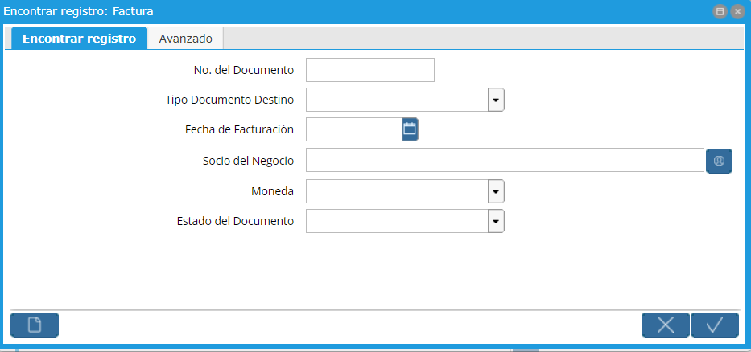

.. |Avanzado| image:: resource/avanzado.png

Características de ventanas en todo el sistema
==============================================

| Algunas ventanas en Solop están diseñadas como ventanas de Alto
  Volumen. Éstas incluyen Socios del Negocio, Productos y Facturas.
| Como usted puede tener miles de registros para estas ventanas. Solop
  desplegará el diálogo "Encontrar Registro" cuando se seleccione una de
  estas ventanas.

Encontrar Registro
------------------

|Encontrar Registro|

Seleccione el botón Registros Nuevos si desea desplegar la ventana en
modo registros nuevos conteniendo solamente los valores predeterminados.

Usted puede también seleccionar la pestaña "Avanzado"  para introducir
más criterios de búsqueda.

Todos los campos definidos para el registro (en este ejemplo Documentos
por Cobrar) están disponibles para búsqueda. seleccione la Columna,
Operador y Valor de Consulta.

|Avanzado|

Seleccione el campo A Valor a Consultar si se selecciona un rango en
Operador. Si desea añadir más criterios de búsqueda seleccione el botón
Salvar para salvar la primer línea de consulta y seleccione el botón
Registro Nuevo para añadir el criterio adicional. Todas las líneas serán
evaluadas usando la lógica “y”, de tal manera que todas las condiciones
deben ser alcanzadas.

Seleccione el botón OK para ejecutar la búsqueda y regresar a la ventana
Producto con los registros que alcancen el criterio de búsqueda.

Seleccione el botón Cancelar para cancelar la búsqueda y regresar todos
los registros.

Posición dentro del rango de registros
--------------------------------------

Igualmente, en la parte inferior derecha de la ventana se encuentran
valore numéricos de la forma mm/nn.

Esto significa: nos encontramos en el registro  número mm de un universo
de nn registros.

El número nn se refiere a los registros desplegados, es decir, si se ha
ejecutado un filtro, el número será menor que el total de registros
existentes. Hay que poner mucha atención al respecto, pues es un error
común de los usuarios filtrar y luego extrañarse que se estén desplegado
 menos registros que los supuestamente existentes.

Auditoría de cambios
--------------------

Puede configurarse el nivel de Auditoría requerido.

Cada ventana en Solop le proporciona información del registro actual. En
la parte inferior derecha de la ventana usted encuentra un campo que
despliega dos valores.

Un + en el frente del valor indica que el registro fue insertado, un \*
indica que  el registro fue cambiado.

Doble o Clic derecho en esos valores para desplegar la persona que creó
y/o actualizó este registro y cuando lo hizo.

Esta ventana puede también desplegar seguimiento de auditoría acerca de
que campos fueron cambiados, junto con el usuario que actualizó el
registro y la fecha.

Esta funcionalidad puede ser habilitada a nivel de Tabla o de Rol. Para
habilitar a nivel de Tabla seleccione el cuadro de verificación Mantener
Histórico de Cambios para la tabla(s) deseada.

En este ejemplo, cualquier cambio hecho a la tabla Cliente por cualquier
usuario será mantenido en el histórico.

Para habilitar en el nivel de Rol seleccione el cuadro de verificación
Mantener Histórico de Cambios para el Rol(es) deseado.

Si usted esta registrando los cambios, éstos pueden ser des-aplicados y
re-aplicados usando la Auditoría de Cambios y la ventana Auditoría de
Sesión.

En el archivo adjunto *Descripcion de ventana.exe* se describen los
componentes más importantes de una ventana.