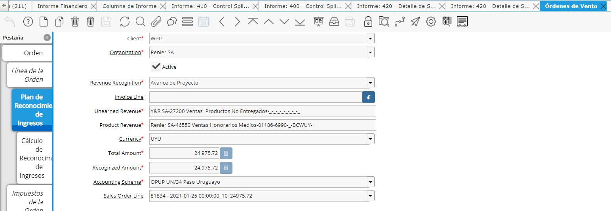

.. |Calculo Reconocimiento de Ingresos| image:: resources/calculo-reconocimiento-de-ingresos.png
.. |Calculo Reconocimiento de Ingresos 2| image:: resources/calculo-reconocimiento-de-ingresos-2.png

.. |Proceso| image:: resources/proceso-calculo-reconocimiento-de-ingresos-2.png

Proceso de Reconocimiento
=========================

El proceso de cálculo del reconocimiento de ingresos, consta de dos
partes:

-  Registro en el plan de reconocimiento
-  Cálculo de reconocimiento

Plan de Reconocimiento
----------------------

En cada línea de Orden que tenga un producto con un Reconocimiento de
Ingresos definido , al completar la Orden se generará automáticamente un
registro de “Plan de Reconocimiento”.

En cada Plan de Reconocimento se definirá:

-  importe a Reconocer
-  Importe Reconocido
-  Moneda
-  Cuenta contable Ingreso Producto
-  Cuenta contable Reconocido No Facturado

Cálculo de Reconocimiento
-------------------------

Cuando se genera el Cálculo de Reconocimiento el sistema consulta además
si ya existe un cálculo de reconocimiento anterior en este Plan de
Reconocimiento. Si existe un Cálculo anterior generará un nuevo registro
con el mismo importe del anterior cálculo pero con signo Negativo y
luego generará si el nuevo cálculo de reconocimiento por el % actual de
avance del proyecto.

Dentro de cada Cálculo de Reconocimiento de Ingreso se encuentran los
siguientes campos:

-  Importe reconocido (FUENTE)
-  Proyect Progress Log
-  Fecha Documento
-  Revenue Recognition Batch
-  Journal
-  Journal Batch

Este cálculo se reconocimiento se puede ver tanto en la ventana de
"Reconocimiento de Ingresos", como también en una pestaña en cada línea
de orden de venta se agregó también la pestaña de Plan de Reconocimiento
correspondiente a la línea y debajo sus correspondientes Cálculos de
Reconocimiento.

    |Calculo Reconocimiento de Ingresos|

Órdenes de Venta con Reconocimiento

Las Órdenes de Venta que tengan definido en la línea un producto con
“Reconocimiento de Ingresos definido” tendrá una pestaña extra debajo de
la línea de la Orden donde se detallará el “Plan de Reconocimiento” y el
correspondiente “Cálculo de Reconocimiento”

    |Plan|

Debajo del Plan se podrá visualizar el Cálculo de Reconocimiento. La
suma de todos los Cálculos de Reconocimiento será el Importe Reconocido.
Cada vez que se corra el proceso, si ya existe un cálculo de
reconocimiento se generará una línea inversa para netear el anterior y
volver a calcularlo según el “Avance actual”.

    |Calculo Reconocimiento de Ingresos 2|

En esta pestaña se podrán visualizar datos importantes que servirán de
verificación como:

-  Revenue Recognition Batch ID: Define el Lote de Reconocimiento donde
   se definirá este Cálculo de Reconocimiento.
-  Journal Batch: Definirá el Lote de Asiento Diario donde se
   contabilizará el Reconocimiento
-  Journal: Definirá el Asiento Contable dentro del Lote de Asiento
   Diario donde se definirá este importe.

Proceso de Cálculo de Reconocimiento de Ingresos
------------------------------------------------

    |Proceso|

Este proceso se generará a partir del Plan de Reconocimiento generado
automáticamente en cada Línea de Orden de Venta que tenga productos con
Reconocimiento de Ingresos definido.

Se puede generar por Proyecto, por Contrato o si no se define nada
correrá para todas las órdenes.