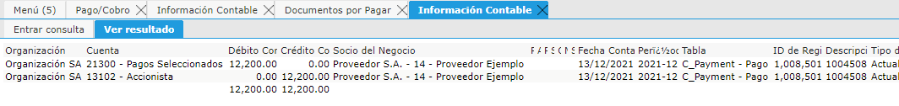

.. |Credito Asignacion| image:: resources/asignacion-haber.png

Pagos Seleccionados (Pasivo)
----------------------------

La cuenta “Pagos Seleccionados” es utilizada como puente entre las
transacciones que se Pagan contra los Documentos que se están
cancelando.

La cuenta *Pagos Seleccionados* se parametriza en la ventana Esquema
Contable, pestaña por Defecto sector Banco.

Documentos que mueve esta cuenta:

**Pago:** Todos los Pagos que sean realizados que no tengan definido un
Cargo ni que son “Anticipo” estarán impactando contra la cuenta contable
“Pagos Seleccionado”

Acción Contable: Débito (Debe)

|Debito Pago|

**Asignación:** Los Saldos existentes en la cuenta puente “Pagos
Seleccionados” se bajarán (Acreditarán) con el documento “Asignación”.
En este documento la idea es definir que Documentos estaría cancelando
el Pago en cuestión que aún no está asignado. En las asignaciones se
puede definir un Documento por Pagar como también un Cobro o incluso
enviar el saldo contra un “Cargo”. En cualquier caso que se seleccione
un pago que no sea un Anticipo se estará acreditando la cuenta “pagos
Seleccionados”.

Acción Contable: Crédito (Haber)

|Credito Asignacion|

**Reporte Auxiliar de Cuenta**

El saldo de la cuenta contable “Pagos Seleccionados” se debería poder
explicar con el Reporte “Pagos sin Asignar”.