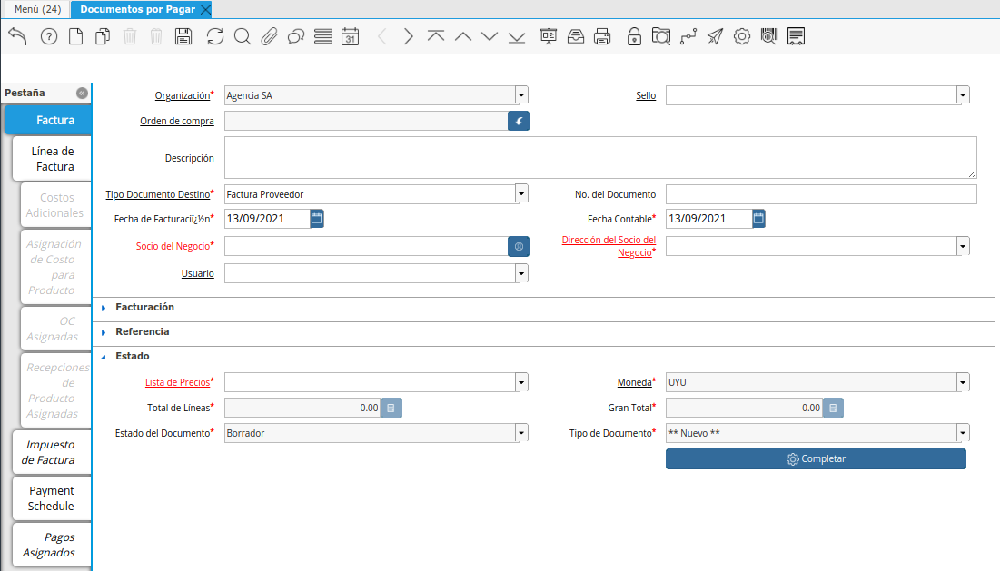

.. |Boton Crear Desde| image:: resources/boton-crear-desde-.png
.. |Completar Documento| image:: resources/complete-document-.png

.. |Seleccionar Lineas| image:: resources/seleccionar-lineas-.png
.. |Smartbrowser| image:: resources/sb.png

Ingreso de Factura de Compra
============================

**Precondiciones con Orden de Compra**
--------------------------------------

Para poder ingresar una factura de una Orden de Compra, esta tiene que
estar

-  Completa
-  Cantidad Facturada < Cantidad Recibida en la Línea de la Orden.

**Documentos por pagar**
------------------------

Utilizaremos esta ventana para ingresar una Factura de proveedor.

Aquí se deberán completar los siguientes campos:

-  Tipo Documento Destino
-  Socio del Negocio
-  Dirección del Socio del Negocio
-  Lista de Precios

|Ventana Documentos por Pagar|

Luego seleccionaremos el botón “Crear Desde”.

|Boton Crear Desde|

Se abrirá un smartbrowser donde deberemos elegir el tipo de documento
mediante el cual vamos a querer generar la factura. Estos son:

-  Delivery/Receipt
-  Invoice
-  Order

|Smartbrowser|

Luego seleccionamos el documento a facturar y realizamos la búsqueda
inteligente haciendo click en "Comenzar búsqueda".

Figurarán en la pantalla las líneas del documento elegido. Debo marcar
el "check" a su izquierda a todas las que quiera facturar y seleccionar
el botón de OK.

**Si el proveedor no entrega exactamente lo solicitado:**

El sistema permite modificar las cantidades en las líneas.

El sistema NO permite modificar importes.

Por lo tanto, para modificar un importe será necesario modificar las
cantidades.

Si lo que se conoce de una factura al registrarla es únicamente el
importe final, se deberá definir en cantidad la cantidad exacta (con
decimales) para que el importe de la factura del proveedor coincida.

Ajuste del registro de la factura proveedor al comprobante físico.

Existen 2 maneras de ajustar el registro de la factura al documento
físico:

Ajustando las cantidades, y el importe se ajustará automáticamente

Incorporando una línea adicional por el concepto “Ajuste”

|Seleccionar Lineas|

Culminaremos el proceso completando el documento.

|Completar Documento|