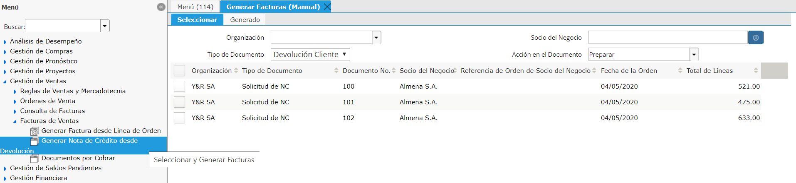

**Generar Devoluciones a Cliente**
==================================

Se deberá realizar la “Devolución de Cliente” cuando un Cliente solicita
o el Ejecutivo de Ventas solicita en nombre del cliente, la emisión de
una Nota de Crédito debido a una “Entrega” (Delivery) No aceptada por el
cliente. Esta “Devolución Cliente” deberá ser generada desde el Proceso
“Generar Devoluciones”, seleccionando la Orden de Venta del Cliente que
se querrá devolver.

|Generar Devoluciones|

Este proceso se deberá realizar si se desea “Corregir” un checking ya
realizado en un Período anterior que se encuentra ya CERRADO. Lo que
realizará esta “Devolución Cliente” son 2 acciones:

Generar un Movimiento contrario a la Entrega realizada por el Checking.
Restando así el Ingreso reconocido con dicha “Entrega”

Generar una Devolución de Proveedor Espejo, es decir se generará una
Devolución Cliente y una Devolución Proveedor por la MISMA CANTIDAD
definida. Dichas devoluciones luego quedarán a la espera de sus
correspondientes Notas de Crédito. Administración podrá ver las
Devoluciones Cliente que están pendientes de Generar Nota de Crédito y
del lado del Proveedor estarán las “Devoluciones Proveedor” (o RMA)
pendientes de generar Notas de Crédito Proveedor cuando estas lleguen.

**Generación de Nota de Crédito**
=================================

Este acto se complementa con la Generación posterior de la “Nota de
Crédito Cliente” a partir de la Devolución Cliente. Esta acción se podrá
realizar mediante el Proceso “Generar Nota de Crédito por Devolución”

|Generar NC Desde Devolucion|

Para que aparezca la información se deberá seleccionar el Tipo de
Documento “Devolución Cliente” y se recomienda definir en Acción del
Documento “Preparar”se generará un Documento por Cobrar del tipo
“e-Factura Nota de Crédito” en estado “En Proceso”. El encargado de
facturación deberá tomar el mismo, verificar las Línea CFE y simplemente
Completarlo. Dicho documento se debería haber generado con toda la
información correspondiente de “Sello, Sello Origen, Contrato de
Servicios, DxC que Asignará, Proyecto, etc.

**Control Nota de Crédito sólo si está facturado**
--------------------------------------------------

Las devoluciones se podrán realizar siempre y cuando exista una
Entrega/Recepción pero estas, si bien pueden aparecer no podrán ser
Facturadas. Si se intenta Facturar dará Error “Not Invoiced” verificando
así que dicha devolución sea sobre una línea que está Facturada.