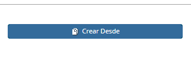
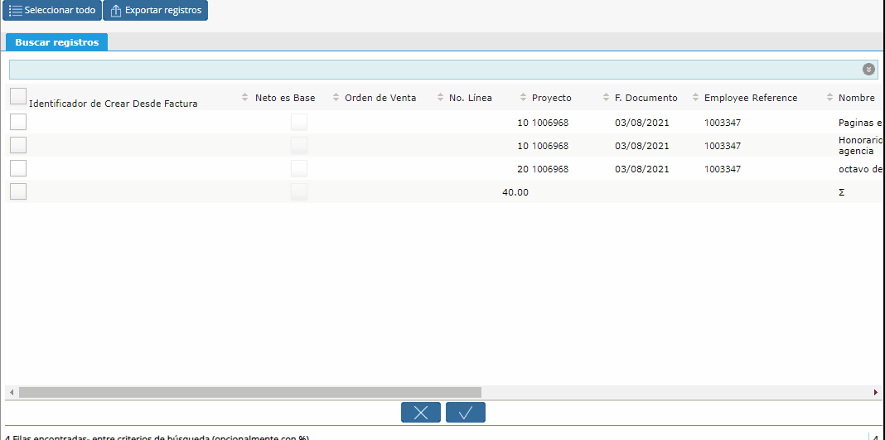
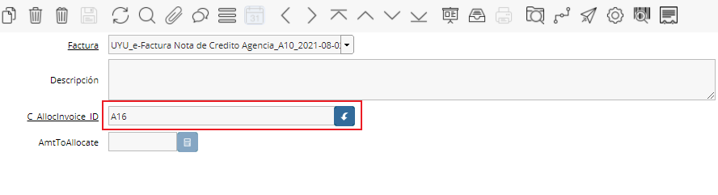

.. |Gif 1| image:: resources/gif1.gif

.. |Smartbrowser| image:: resources/sb.png

**Generar Nota de Crédito Cliente desde la Factura**
====================================================

Para generar una Nota de Crédito Cliente mediante la opción **“Crear
desde”** se utilizará la ventana Documentos por Cobrar.

.. only:: html

    .. figure:: resources/gif1.gif

    Video 1. Gif 1

Se deberá ingresar:

-  Tipo de Documento: Nota de Crédito
-  Socio de Negocio: Cliente al que se facturará
-  Tipo Autorización Devolución: Motivo por el cual se hace la Nota de
   Crédito

Guardaremos el cabezal y seleccionaremos el botón “Crear desde”:

|Crear Desde|

Este botón permitirá crear la Nota de crédito desde una Orden de venta o
compra, Factura o Recibo.

Seleccionaremos el tipo de documento, el documento en cuestión y
realizaremos la búsqueda smartbrowser.

|Smartbrowser|

Esta búsqueda nos mostrará todas las líneas del documento, las cuales
podemos seleccionar mediante un “check” modificando sus cantidades si se
desea.

Luego correremos el proceso seleccionando el botón de OK.

.. only:: html

    .. figure:: resources/gif2.gif

    Video 2. Gif 2

Inmediatamente el sistema cargará las líneas a la Nota de crédito (donde
se podrán modificar las cantidades y los importes) y definirá en la
pestaña CFEs Referidos la factura que estoy asignando.

|Pestaña CFEs Referidos|

Por último procederemos a completar la Nota de Crédito.

La misma quedará con el check “pagado” siempre que haya sido por el
total de la factura.

**NOTA: Para ingresar una Nota de crédito Proveedor se utiliza el mismo
procedimiento de ingreso de una factura de compra, indicando como Tipo
de documento una Nota de crédito.**