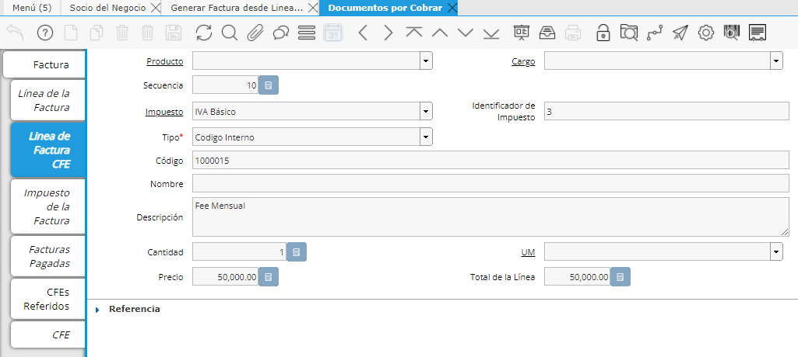

.. |DxC Criterio Facturación Fase| image:: resource/criterio-facturacion-fase-dxc.png
.. |SDN Criterio Facturación| image:: resource/criterio-de-facturacion-sdn.png

.. |Documento por Cobrar Criterio Facturación Linea| image:: resource/docxcobrar.png
.. |Generar Factura desde Linea de Orden| image:: resource/generar-factura-linea-de-orden.png
.. |Generar Lineas Factura CFE| image:: resource/generar-lineas-factura-cfe.png
.. |SDN Criterio Facturación Fase| image:: resource/sdn-criterio-de-facturacion-fase.png

**Facturación por Proyecto**
^^^^^^^^^^^^^^^^^^^^^^^^^^^^

Al facturar por Proyecto el sistema generará una línea por todas las
líneas que posea el Proyecto con la descripción del mismo, la cual
obtiene del campo “Detalle en Factura” del cabezal del Proyecto.

En la ventana Socio del Negocio, pestaña Cliente, en el campo "Criterio
de Facturación" se puede indicar “Proyecto”, para este Socio de negocio.
De esta forma se puede automatizar este procedimiento ya que la factura
tomará de forma automática este dato.

|SDN Criterio Facturación|

Luego, mediante la ventana Generar factura desde línea de Orden, se
procederá a facturar buscando entre las diferentes líneas que tengan las
Órdenes de Venta en estado Completo.

En la parte inferior de esta ventana veremos distintas opciones
utilizadas al momento de generar la factura.

|Generar Factura desde Linea de Orden|

-  Fecha de Facturación: (Obligatorio)
-  Acción en el Documento: (Preparar, completar)
-  Organización de la Trans.
-  Criterio de Agrupación: Es el criterio para agrupar las líneas de
   orden ya sea por Socio de negocio, Contrato, Proyecto, Orden ,
   Impuesto, POReference, Adicionales).

**NOTA: Tener en cuenta que el "Criterio de Agrupación" y el "Criterio
de Facturación" NO son lo mismo.**

Luego seleccionaremos el botón de OK y se generará el Documento por
cobrar correspondiente.

Al mismo podemos acceder desde el ícono de documentos relacionados desde
el cabezal de la orden de venta.

Este factura tendrá definido en el cabezal de la misma, en la región de
Facturación, el correspondiente Criterio de Facturación elegido.

|Documento por Cobrar Criterio Facturación Linea|

Si elige no hacerse este procedimiento de forma automática lo podremos
hacer manualmente.

Para realizarlo seleccionaremos la opción “Proyecto” en el campo
Criterio de Facturación de la factura y a continuación correremos el
proceso “Generar líneas de factura para CFE” utilizando el ícono de la
tuerca.

|Generar Lineas Factura CFE|

Generará también en la pestaña Línea de la factura CFE una línea cuya
Descripción tendrá definida lo mismo que se definió en el campo “Detalle
en Factura” en el cabezal del Proyecto.

|Descripción|

**\*Siempre se agrupan las líneas que no sean Honorarios ya que éstos
van en otra línea a parte.**

**Facturación por Fase**
^^^^^^^^^^^^^^^^^^^^^^^^

Al facturar por Fase el sistema generará una línea agrupándolas por Fase
del Proyecto con la descripción de las mismas, las cuales obtiene del
campo “Detalle en Factura” de las fases del Proyecto.

En la ventana Socio del Negocio, pestaña Cliente, en el campo Criterio
de Facturación se puede indicar “Fase de Proyecto”, para este Socio de
negocio.

De esta forma se puede automatizar este procedimiento ya que la factura
tomará de forma automática este dato.

|SDN Criterio Facturación Fase|

Luego, mediante la ventana Generar factura desde línea de Orden, se
procederá a facturar buscando entre las diferentes líneas que tengan las
Órdenes de Venta en estado Completo.

Podremos acceder al Documento por cobrar desde el ícono de documentos
relacionados desde el cabezal de la orden de venta.

Este factura tendrá definido en el cabezal de la misma, en la región de
Facturación, el correspondiente Criterio de Facturación elegido.

|DxC Criterio Facturación Fase|

Si elige no hacerse este procedimiento de forma automática podremos
hacerlo manualmente.

Para realizarlo seleccionaremos la opción “Proyecto” en el campo
Criterio de Facturación de la factura y a continuación correremos el
proceso “Generar líneas de factura para CFE” utilizando el ícono de la
tuerca.

|Generar Lineas Factura CFE|

Generará también en la pestaña Línea de la factura CFE la cantidad de
líneas según la cantidad de fases que tenga el Proyecto.

Estas líneas tendrán definidas en el campo “Descripción” lo mismo que se
definió en el campo “Detalle en Factura” a las fases del Proyecto.

**Siempre se agrupan las líneas que no sean Honorarios ya que éstos van
en otra línea a parte.**