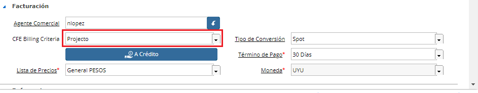

.. |Pestaña Linea de Factura CFE| image:: resource/cfe-invoice-line-tab.png
.. |Campo Detalle en Factura| image:: resource/detail-in-invoice.png
.. |Generar Factura desde Línea de Orden Sb| image:: resource/generate-invoice-from-sales-order-process.png
.. |Proceso Generar Lineas de Factura para CFE| image:: resource/process-generate-invoice-lines-for-cfe.png

Generar Factura desde Orden de Venta

Las órdenes de venta generadas en el sistema pueden ser facturadas de
manera ágil y masiva utilizando el proceso "Generar Factura desde Línea
de Orden". En este proceso se podrá aplicar el filtro que desee para
encontrar aquellas líneas de ordenes que cumplan con dichas condiciones.

Dentro de los filtros a definir podemos encontrar:

.. image:: /api/v3/attachments/486/content

**Generar Factura**
-------------------

Y comenzaremos la búsqueda, a continuación obtendremos las líneas de
Orden de Venta que cumplan con la condición. Procederemos a marcar el
check que esté como primer columna para todas las líneas que se deseen
facturar.

.. image:: /api/v3/attachments/435/content

En la parte inferior de esta ventana veremos distintas opciones
utilizadas al momento de generar la factura:

.. image:: /api/v3/attachments/436/content

Una vez seleccionadas todas las líneas que se desean Facturar, el
sistema permite definir diferentes criterios para la inclusión de dichas
líneas en la o las facturas. Para generar la Factura se deberá definir
una **FECHA** así como también el **Criterio de Agrupación** que se
desea aplicar.

**Acción en el Documento:** Si desea ver la Factura antes de completarla
puede seleccionar la opción "Preparar" de manera de que se genere el
documento primero en estado "En Proceso" y así poder verificar que todo
esté correctamente definido. En este caso al generar el proceso se
creará la factura con un Nro de Borrador "DR-2222" y podrá acceder a la
misma tanto desde el proyecto u Orden desde donde se generó, cómo
también buscando en la ventana "Documentos por Cobrar" según el Nro de
borrador presentado abajo a la izquieda del Proceso. Si uno está seguro
de la información que estará facturando también puede seleccionar la
acción "Completar" de manera de que se completen automáticamente las
facturas al correr el proceso.

**Tipo de Documento:** El sistema controlará si el Socio del Negocio a
quien se está facturando tiene definido un RUT o una Cédula y le
generará una e-Factura o un e-ticket según corresponda.

Según el **Criterio de Agrupación** definido es la forma en que el
sistema agrupará las líneas de órdenes en una Factura, estas puede ser
por:

-  **Socio del Negocio:** Generará una Factura con todas las líneas de
   Orden de por cada Socio del Negocio diferente.
-  **Contrato:** Generará una factura por cada Contrato establecido en
   las Órdenes de Venta, agrupará en esa factura todas las Órdenes que
   pertenezcan al mismo contrato.
-  **Proyecto:** Si la línea tiene definido el Proyecto utilizará esta
   referencia y en caso de no tenerlo establecido tomará el de su
   respectiva orden (puede ser que en una misma agrupación algunas
   líneas tengan Proyecto relacionado y a la vez otras que se tenga que
   obtener de su respectivo Cabezal), Siguiendo este criterio se
   generará un Documentos por Cobrar por proyecto diferente.
-  **Orden:** La agrupación que agrupa menos registros