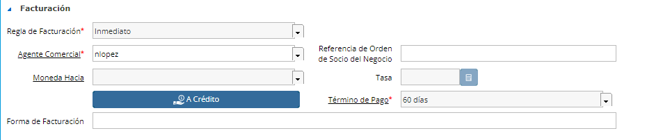
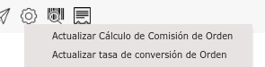

.. |Actualizar Tasa de Conversion de Orden| image:: resources/update-conversion-rate-process-2.png

**Facturar al Cliente en moneda diferente al Costo**
====================================================

En caso que al Cliente se le deba Facturar en otra moneda, la Orden de
Venta deberá ser en la misma moneda que se comprará al Proveedor, pero
se podrá definir en la Orden de Venta una moneda diferente a ser
Facturado junto con su Tasa de Cambio acordada.

|Seccion de Campos de Facturacion|

En caso de querer definir la Tasa de conversión luego de completar la
Orden o modificar la misma luego de completarla se podrá hacer desde el
proceso.

|Actualizar Tasa Barra de Herramientas|

|Actualizar Tasa de Conversion de Orden|