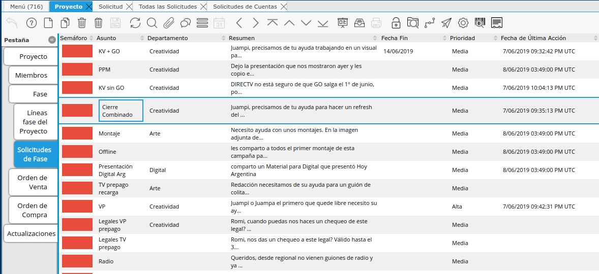
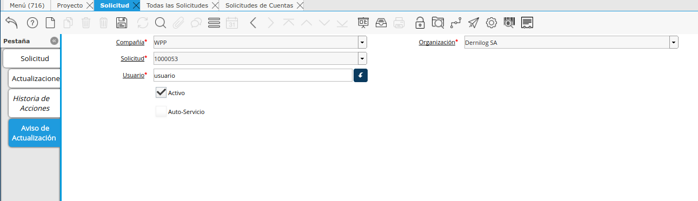

.. |Ventana Todas las Solicitudes| image:: resources/all-requests-window.png
.. |Solicitud Menu| image:: resources/menu.png

.. |Ventana Solicitud| image:: resources/request-window.png

**Solicitudes del Proyecto**
============================

Dentro de cada Proyecto se podrá crear diferentes Solicitudes asociadas
al mismo. La ventaja de generar las Solicitudes desde un Proyecto, Fase
o Tarea es que tomará del contexto toda la información que necesite,
como Proyecto, Cliente, etc.

Desde la ventana Proyecto se podrá visualizar todas las Solicitudes
relacionadas, tanto desde la Pestaña de Solicitudes correspondiente como
desde la Barra de herramientas (Ver todas las solicitudes).

|Proyecto Pestaña Solicitudes de Fase|

**Solicitud (To-Do)**
---------------------

Una Solicitud refiere a una Tarea específica (To-Do) que tiene
determinado *Asunto*, *Descripción* y está *Asignado A* un Usuario con
determinada *Fecha de Siguiente Acción* y *Fecha de Fin*.

Esta Solicitud a su vez, puede estar vinculada a diferentes documentos a
lo largo del sistema, como por ejemplo un Proyecto, un Cliente, una
Orden de Venta, una Factura, una Marca, un Sello, etc.

Dentro de una Solicitud se podrá agregar *Comentarios* y modificar el
“\ *Asignado A”* o el *Estado* de la misma a medida que avanza el
desarrollo de la misma. Cada Solicitud se podrá visualizar el histórico
de Actualizaciones que la misma tuvo desde la pestaña de
*“Actualizaciones”* detallando la Fecha-Hora, Usuario, Comentario así
como demás cambios en los campos que fue realizando.

Cada Actualización que se realice sobre la Solicitud, el sistema estará
enviando automáticamente notificaciones a cada usuario que esté
vinculado a la misma. El tipo de Notificación a enviar dependerá de la
Configuración de Notificaciones que cada usuario tenga definida (e-mail
o aviso interno).

*\*para ver más en detalle sobre las notificaciones ver “Notificaciones
del Sistema”.*

|Ventana Todas las Solicitudes|

**Solicitudes Asignadas a uno**
-------------------------------

Esta ventana será la que el usuario siempre ingresará para ver todo lo
que tiene pendiente de realizar, viendo claramente todo lo que tiene
pendiente.

En la ventana “Solicitudes” se podrán visualizar todas las Solicitudes
que estén asignadas a uno mismo (su Usuario) o al Departamento que uno
pertenece.

|Ventana Solicitud|

Acceso directo a la ventana
~~~~~~~~~~~~~~~~~~~~~~~~~~~

Esta ventana será de muy fácil acceso, existiendo un acceso directo
desde la Bandeja de Entrada del usuario con el Botón “Solicitudes”. Al
costado del nombre del botón se podrá visualizar la cantidad de sus
Solicitudes que tiene “Vencidas”

|Solicitud Menu|

Todas las Solicitudes
---------------------

En esta Ventana de “Todas las Solicitudes” se podrá visualizar todas las
Solicitudes que estén creadas en el sistema. Cada usuario podrá ver las
que le permita su Rol y en la misma se podrá aplicar los filtros
deseados para buscar las que necesite ver.

Solicitudes de Cuentas
----------------------

La Ventana de “Solicitudes de Cuentas” está creada para que los
Ejecutivos de cuenta específicamente (que serán “Gerentes de Proyecto”
de todos aquellos proyectos que estén bajo su control) puedan visualizar
en una misma ventana todas las Solicitudes que están pendientes dentro
de los sus Proyectos.

Estas podrán estar asignadas a ellos o a cualquier otro usuario.

Historial de Actualizaciones de Solicitud (Feed)
------------------------------------------------

Dentro de cada Solicitud se podrá visualizar el historial de
actualizaciones que tuvo la misma a lo largo del tiempo. En cada
Actualización se podrá visualizar el cambio realizado y por quién fue
realizado. En caso de haber adjuntado una imagen la misma se podrá
visualizar en modo “Registro único” sin tener que ver el adjunto en la
Barra de Herramientas.

Notificaciones de Actualización
-------------------------------

Cada Solicitud envía notificaciones de sus actualizaciones a los
usuarios definidos como:

-  Asignado A
-  Creado Por
-  Departamento
-  Aviso de Actualización

Como verá, además de los usuarios vinculados, dentro de cada Solicitud
se podrá agregar diferentes usuarios para que les llegue vía correo
electrónico las notificaciones por actualización de las mismas,
independientemente de los demás criterios. Para ello simplemente se
deberá navegar a la pestaña “Aviso de Actualización” y agregar
manualmente el o los usuarios a recibir notificaciones.

|Solicitud Pestaña Aviso de Actualizacion|