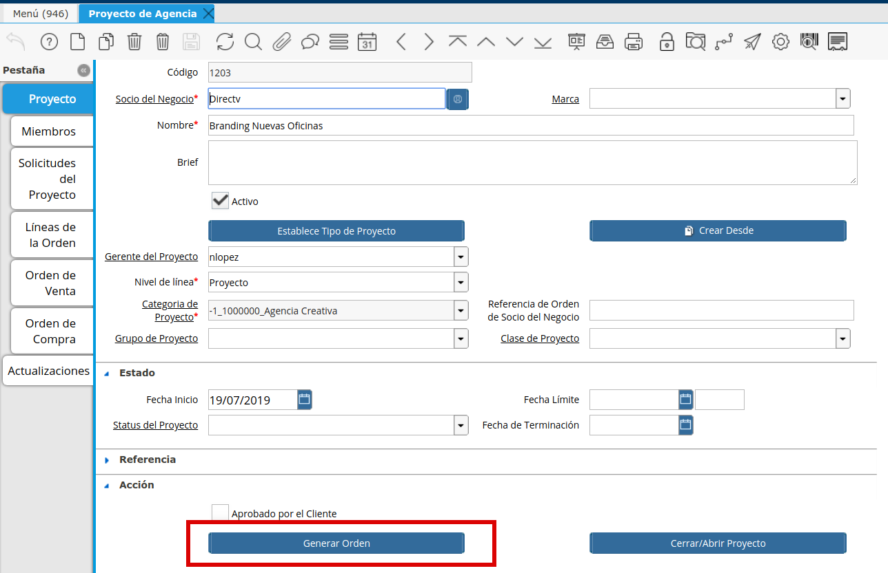
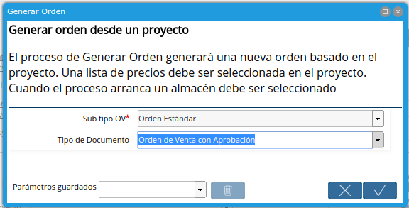

.. |Icono Adjunto| image:: resources/attachment-icon.png

.. |Check Aprobado por el Cliente| image:: resources/customer-approved.png
.. |Iconos Barra de Herramientas| image:: resources/icons.png

.. |Proyecto de Agencia Pestaña Orden de Venta| image:: resources/sales-order-tab-agency-project-window.png

**Orden de Venta desde Proyecto**
=================================

En cada Proyecto, cuando un trabajo deba ser facturado al Cliente, se
deberá generar una Orden de Venta vinculada al mismo.

Para generar una Orden de Venta desde un Proyecto, se deberá definir en
la Línea del Proyecto:

-  el Producto/Servicio
-  el Precio
-  la Cantidad
-  una Descripción

La ubicación de la Pestaña de “Línea” dependerá del *Nivel de Línea*
seleccionado en el Proyecto, desplegando según corresponda Línea del
Proyecto, Línea de la Fase o Línea de la Tarea.

Una vez definido el *Producto/Servicio* en la Línea que corresponda, se
deberá  generar una Orden de Venta desde el Botón “Generar Orden”
ubicado en el Cabezal del Proyecto, en el Grupo de Campos “Acción”. La
misma será generada tomando toda la información que se haya definido en
las Líneas.

|Boton Generar Orden|

|Proceso Generar Orden|

Las Órdenes de Venta generadas desde un Proyecto se pueden visualizar de
diferentes maneras.

Vista de la Orden de Venta desde la Pestaña del Proyecto
--------------------------------------------------------

Una opción es desde la pestaña de “Orden de Venta” definida mismo en la
Ventana de Proyecto de Agencia. En ella podrán ver de manera resumida
todos los datos referente a una Orden de Venta que necesitan.

|Proyecto de Agencia Pestaña Orden de Venta|

Vista de la Orden de Venta navegando desde el Proyecto
------------------------------------------------------

Otra opción puede ser utilizando la Navegación a Documentos Relacionados
existente en todos los documentos

|Iconos Barra de Herramientas|

Tener en cuenta que la Orden de Venta que se genere siempre tendrá en su
Descripción el nombre del Proyecto / Fase / Tarea desde donde se generó.
Además, se definirá en la Descripción de la línea de Orden de Venta la
*Descripción* que se defina en la línea del Proyecto.

Controles en la Orden de Venta
------------------------------

-  Aprobado por Cliente
-  Archivo Adjunto

Las Órdenes de Venta cuentan con un control de Aprobación de Clientes.
Para poder completar la Orden de Venta se deberá Marcar en “Y” el Check
“Aprobado por Cliente” y además contar con un archivo adjunto a dicha
Orden. La idea es que se adjunte la autorización que se tuvo del cliente
para proceder con dicho pedido.

|Check Aprobado por el Cliente|

|Icono Adjunto|