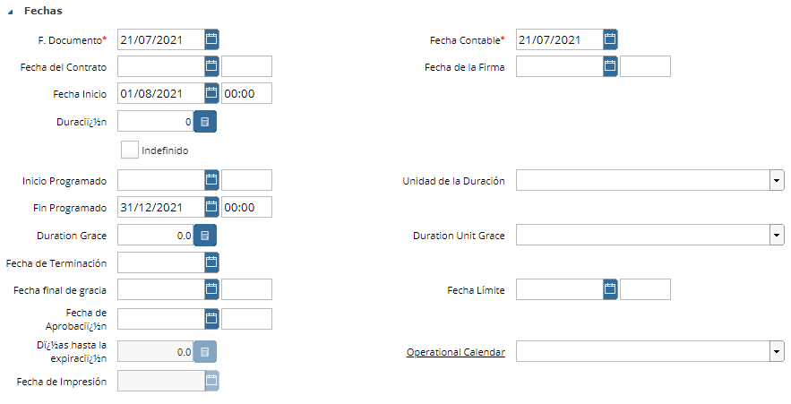

.. |Facturacion Cabezal| image:: resources/facturacion-cabezal.png
.. |Marca y Organizacion Cabezal| image:: resources/marca-y-organizacion-cabezal.png

**Contrato de Servicios de Agencia**
====================================

El Contrato con un Socio de Negocio resume en un documento la
representación de determinado acuerdo realizado con un Tercero. Este
Acuerdo puede ser tanto con un Cliente como con un Proveedor y regulará
condiciones para las transacciones a realizar entre ambos.

Cabezal de la ventana Contrato de Servicio
------------------------------------------

Aquí deberán definirse los siguientes datos:

-  **Marca:** Aquella que le facturará al cliente (siempre se debe
   facturar con una única marca).
-  **Organización:** Desde donde se le facturará al cliente.

|Marca y Organizacion Cabezal|

-  **Socio del Negocio:** Identifique la contraparte del contrato.

|Socio del Negocio Cabezal|

-  **Fechas del Contrato**

   -  Fecha del Documento: Fecha en que se suscribe el Contrato
   -  Fecha contable
   -  Fecha Inicio
   -  Fin Programado
   -  Duración: En unidad de duración.
   -  Unidad de duración: Generalmente es Mes, (también puede ser
      Segundo, Minuto, Hora, Día o Año).

|Facturacion Cabezal|

-  **Lista de precios**
-  **Agente comercial:** Encargado del contrato

|Fechas Cabezal|

**Check "OC Necesaria para Facturar"**

Según el Contrato con el cliente se puede definir si es obligatorio o no
que el Nro. de la Orden de Compra del Cliente esté definido en las
Factura al cliente o no.

Para que este check pueda ser marcado, para aquellos Socios de Negocio
que su contrato tiene definido “OC Necesaria para Facturar” se deberá
completar el campo “OC Cliente” con el número de la Orden de Compra del
Cliente y luego Marcar el “Permite Facturar” = SI