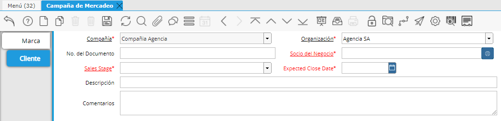

.. |Campaña de Mercadeo Cabezal| image:: resources/heading-marketing-campaign.png

Crear Marca del Cliente obligatoria
-----------------------------------

Una Marca Cliente se creará desde la ventana "Campaña de Mercadeo".

En el cabezal de la ventana se deberá indicar el nombre de la Marca.

|Campaña de Mercadeo Cabezal|

Luego bajaremos a la pestaña Cliente donde deberemos completar los
siguientes campos:

-  Sales Stage: Donde seleccionaremos "Marca Cliente".
-  Socio del Negocio: Será el Socio del negocio al que le estamos
   creando dicha Marca.
-  Expected Close Date: Fecha de cierre esperada.

|Campaña de Mercadeo Pestaña Cliente|

A continuación se muestra un ejemplo del procedimiendo para crear una
Marca Cliente:

.. only:: html

    .. figure:: resources/gif-del-proceso.gif

    Video 1. Gif del Proceso