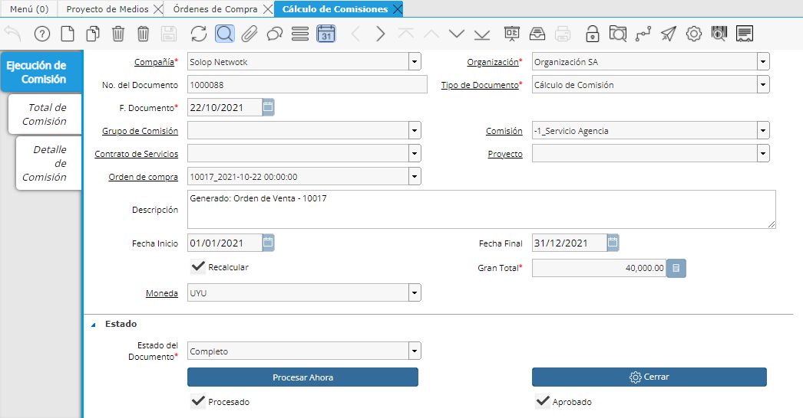
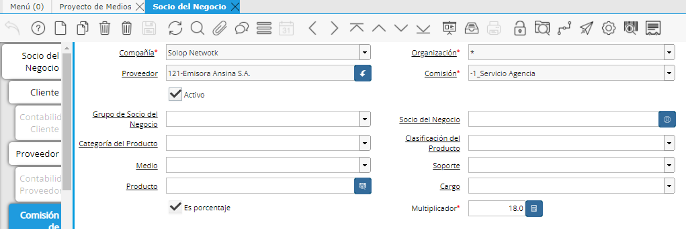
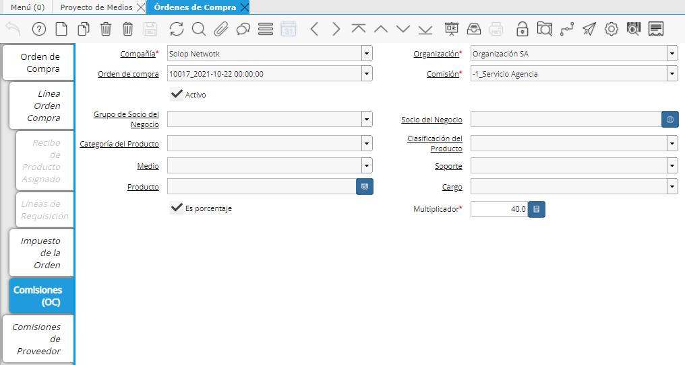
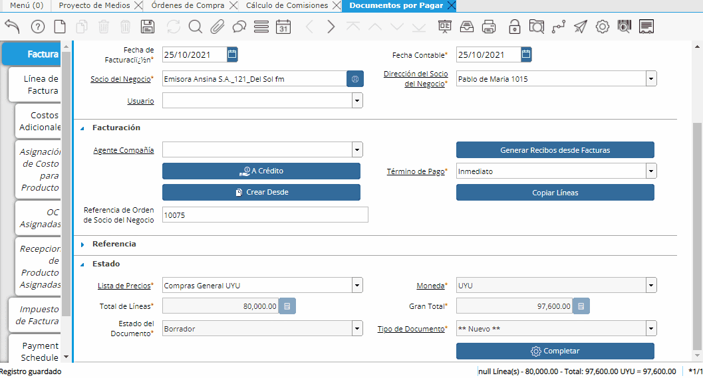
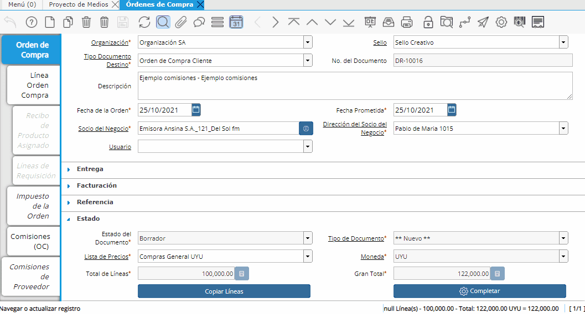
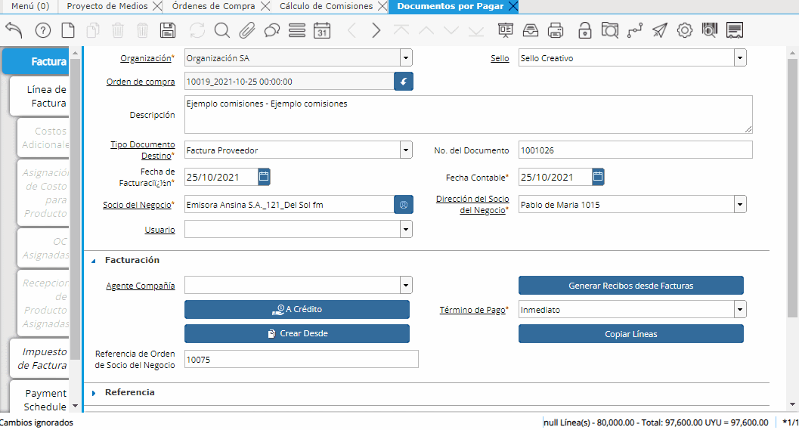
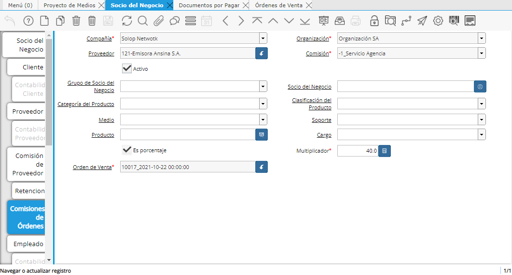
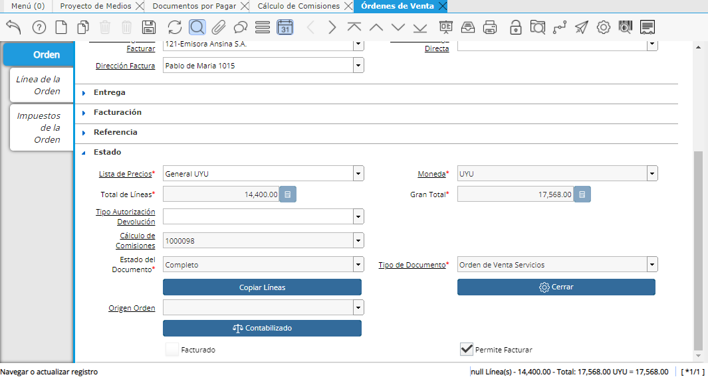
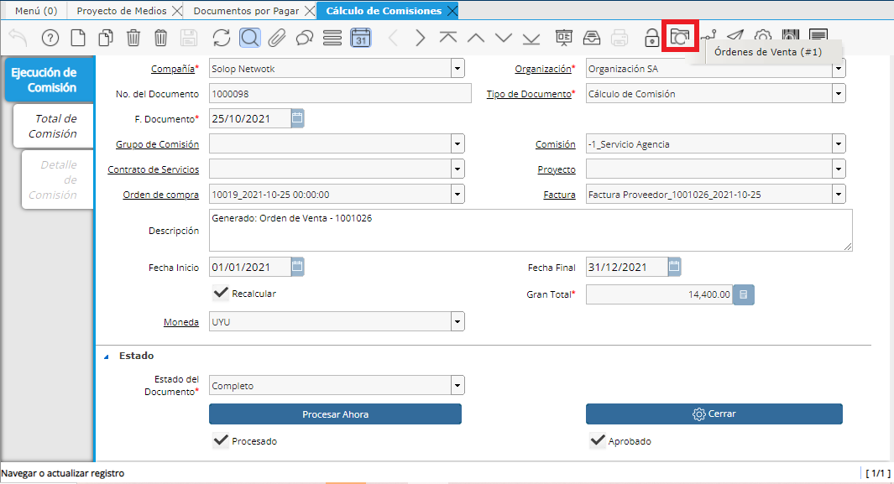
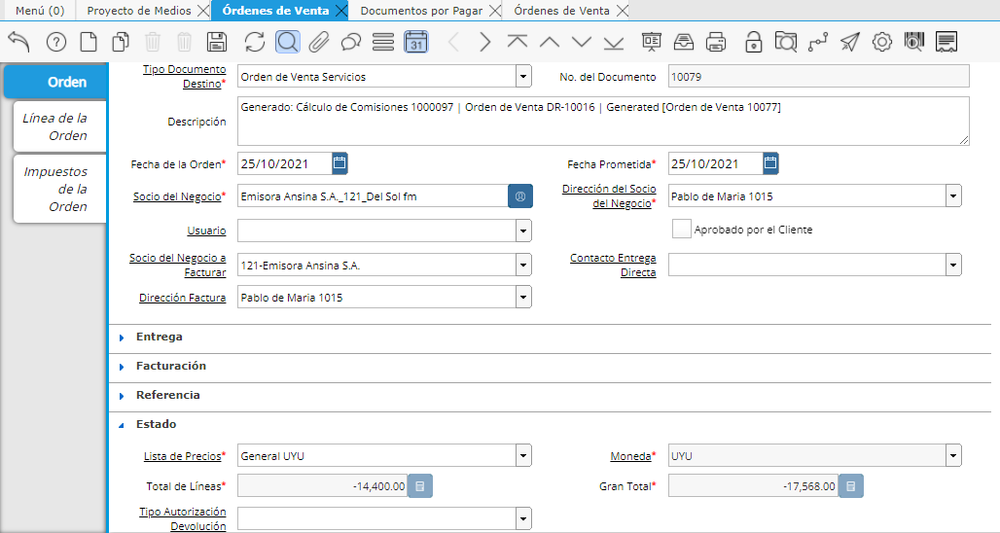

**Cálculo de Comisiones al proveedor**
~~~~~~~~~~~~~~~~~~~~~~~~~~~~~~~~~~~~~~

Los Cálculos de Comisiones al proveedor que se aplican a una compra se
crearán al completar la Orden de Compra por la Inversión del Cliente.

|Gif Completar OC|

**IMPORTANTE:**

En el caso de las Comisiones tenemos un funcionamiento diferente al de
Honorarios ya que estas son nuevamente calculadas cuando llega la
factura del proveedor.

Se va a permitir descontar o canjear el importe según la Factura y no
según la Orden de Compra total.

Por lo tanto procederemos a ingresar la factura del proveedor filtrando
por la orden de compra generada e indicaremos para este ejemplo que en
vez de 10 la cantidad facturada será 8.

|Gif Ingresar Factura Proveedor|

Al completar la factura automáticamente se va a generar un Cálculo de
comisiones.

Este Cálculo de comisiones calculará la comisión para el importe
facturado.

|Gif Completar Factura Proveedor|

Desde el Cálculo de comisiones podremos acceder a la Orden de venta por
la comisión hecha al Proveedor, la cual desde ya tendrá el check de
permite facturar en “Y”.

Esto es así por el supuesto de que si ya llegó la factura del proveedor
quiere decir que ya se podrá facturar la comisión y proceder a hacer el
correspondiente canje y cancelación al momento de pagarle al proveedor.

|OV Comision Proveedor|

|OV Comision Proveedor Permite Facturar|

**IMPORTANTE:**

Solamente en aquellas Órdenes de compra que son facturadas directo entre
el Proveedor y el Cliente se deberá aplicar el check de permite facturar
de forma manual.

**Lógica del sistema al Facturar una Orden de Compra con Comisión**
~~~~~~~~~~~~~~~~~~~~~~~~~~~~~~~~~~~~~~~~~~~~~~~~~~~~~~~~~~~~~~~~~~~

Tendremos entonces una Orden de venta por el Cálculo de comisión sobre
la Orden de compra original y otra Orden de venta por lo que ya de esa
comisión pudo ser facturado.

El sistema para no duplicar el importe a comisionar hará una Orden de
venta negativa por el importe de la Orden de venta comisión que se hizo
a partir de la factura.

|OV Negativa|

**Definición de Comisiones al proveedor**
~~~~~~~~~~~~~~~~~~~~~~~~~~~~~~~~~~~~~~~~~

Los porcentajes de Comisiones al proveedor se tomarán según la
definición que tenga éste en la ventana Socio del negocio pestaña
Comisión de Proveedor.

|Comision de Proveedor Ventana SDN|

Opcionalmente, si existieran diferentes porcentajes a aplicar según el
Tipo de producto, se podrían hacer tantos registros como diferentes
porcentajes existan, de manera que el producto se filtre al porcentaje a
aplicar.

**Definición de Comisión en la Orden de Compra**
~~~~~~~~~~~~~~~~~~~~~~~~~~~~~~~~~~~~~~~~~~~~~~~~

Pueden existir casos en que haya un acuerdo especial con el proveedor
donde podremos definir un porcentaje de comisión mayor o menor al
habitual.

Desde la Orden de compra pestaña Comisiones (OC), definiremos un
porcentaje de comisión único para esta Orden de compra en el campo
“Multiplicador”.

|Definicion Comision en OC|

Si navegamos al Cálculo de comisiones veremos que esta se generó por el
porcentaje indicado en la Orden de compra:

|Calculo Comisiones OC|

Si queremos modificar este porcentaje especial de comisiones lo haremos
desde la ventana Socio del negocio del proveedor, pestaña Comisiones de
órdenes, indicando el nuevo valor en el campo “Multiplicador”.

|Modificar Porcentaje Especial de Comision|

Hecho esto, deberemos ir a la Orden de Compra en cuestión y correr el
proceso de Actualizar cálculo de comisión.

De esta manera los Cálculos de comisiones generados antes de aplicar
este proceso serán Cerrados al igual que su Orden de venta por la
comisión.

Se generarán los nuevos Cálculos de comisiones aplicando el nuevo
porcentaje definido y una nueva Orden de venta por la comisión en estado
Completo.