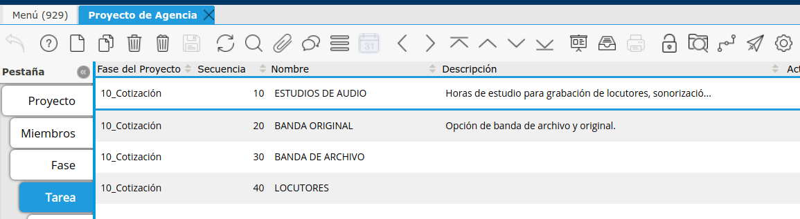
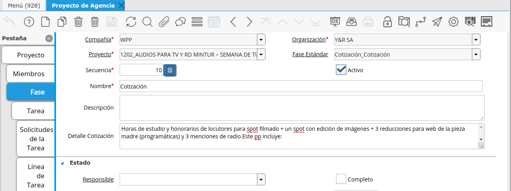

.. |Pestaña Tarea| image:: resource/task-tab.png

Cotización para Clientes
~~~~~~~~~~~~~~~~~~~~~~~~

El Ejecutivo de Cuentas creará un Proyecto en el cual definirá lo
solicitado por el cliente. En caso de que el mismo incluya realizar una
Cotización de determinados servicios/productos a diferentes proveedores
externos se deberá seleccionar un Tipo de Proyecto que contemple la
“Cotización”.

Los Tipos de Proyecto pueden ser:

Producción Interna + Cotización: En caso que se necesite trabajos de
creatividad como también cotización a proveedores. Al seleccionarla se
crearán automáticamente 2 Fases:

Cotización: En caso que sólo se deba gestionar la cotización de
determinados servicios o trabajos. Al seleccionarla se creará
automáticamente 1 Fase:

En ambos Tipos de Proyecto se deberá también definir el Nivel de Línea
“Tarea”.

Dentro de la Fase *Producción*, el Ejecutivo de Cuenta deberá crear como
TAREAS todos las diferentes Cotizaciones que se deberán realizar
clasificando según “Tema a Cotizar”.

En cada TAREA se podrá definir una *Categoría* de “Cotización a
Proveedores” para que facilite su identificación. Además se podrá
asignar a un *Responsable* de la misma (Considerar que para poder
asignar como responsable a un usuario, el mismo deberá estar definido
como “Miembro del Proyecto”).

Fase generada automáticamente. Sólo se deberá agregar en el campo
“Detalle Cotización” el detalle de lo que se desea Cotizar.

|Pestaña Fase|

**Tareas con cada Cotización a realizar.**

*Descripción*: se deberá definir el el texto que se enviará al Proveedor
en la Solicitud de Cotización. Este podrá ser modificado si se desea
luego por Producción.

Campo “Ayuda”: se podrá agregar un comentario para que Producción
considere en caso de ser necesario para realizar la cotización.

|Pestaña Tarea|

|Grilla de la Pestaña Tarea|

**Generar Orden de Venta desde Solicitud de Cotización**
~~~~~~~~~~~~~~~~~~~~~~~~~~~~~~~~~~~~~~~~~~~~~~~~~~~~~~~~

Una vez generada la Solicitud de Cotización (RFQ-Request for Quotation),
evaluadas las respuestas, y aceptado una Respuesta de Cotización por el
Cliente, se deberá proceder a generar una Orden de Venta al Cliente para
que la misma se pueda aprobar mediante el flujo de aprobación estándar
de la Orden de Venta.

La Orden de Venta se podrá generar directo desde la Solicitud de
Cotización desde el botón “Crear Orden de Venta”.

Seleccione el Tipo de Orden de Venta “Orden de Venta con Aprobación”.
Esta se generará con las líneas de la Solicitud de Cotización en
cuestión, tomando la Respuesta de Cotización seleccionada como “Ganador
Seleccionado” para definir los campos *Precio* según el definido en el campo “Precio Factura” y como “Socio del Negocio de
Entrega Directa” al Proveedor de la misma.

Luego de generarla desde el proceso ubicado en el botón “Crear Orden de
Venta”. Se podrá navegar a la misma desde el campo “Orden de Venta”
existente al lado del botón.

|Boton Crear Orden de Venta|

Al Completar la Orden de Venta luego de la aprobación del Cliente,
automáticamente se generará la Orden de Compra Enlazada según Entrega
Directa.

Orden de Venta con Margen
'''''''''''''''''''''''''

En caso de contar con “% de Margen” (Mark-Up), el precio real enviado
por la Cotización se definirá en la línea de la Orden de Compra. En caso
de no existir “Mark-Up” los precios de la Orden de Venta y los precios
de la Orden de Compra serán iguales.