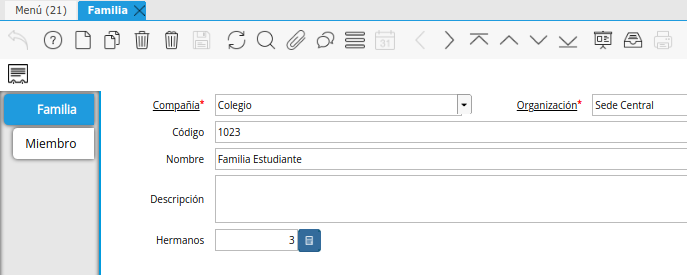

.. |Crear Descuentos de Contrato| image:: resources/crear-descuentos-de-contrato.png
.. |Actualizar Descuentos de Lineas de Contrato| image:: resources/actualizar-descuentos-de-lineas-de-contrato.png

Descuentos en Contratos
=======================

Un Contrato de Servicios podrá contar con más de un Descuento
establecido.

En base a todos los descuentos que tenga definido un Contrato se le
definirá el Descuento final que tendrá realmente en las líneas de
Servicios que entre en la condición de los Descuentos. Por ejemplo que
sólo apliquen sobre los Productos de Categoría de Producto: Servicios
Educativos (Cuotas).

Los Descuentos en los Contratos se podrán definir de las siguientes
maneras:

-  Definir la cantidad de Hermanos en la Familia: Al momento de guardar
   un Socio del Negocio como Miembro de la Familia el sistema verificará
   que el mismo sea de Tipo de Relación = “Hijo” y que tenga un Contrato
   de Servicio creado en el sistema. En ese momento se actualizará
   automáticamente en la Ventana Familia el Campo “Cantidad de Hijos”.

|Familia|

-  Definir el porcentaje según la cantidad de Hermanos: Desde el
   Contrato se deberá definir el Descuento correspondiente a la Cantidad
   de Hermanos. Para ello se deberá ir a los Procesos del Contrato y
   correr el Proceso: “Crear Descuentos de Contrato”. Este proceso
   definirá un Descuento según las líneas del Esquema de Descuentos
   llamado “Descuentos Hermanos” de Tipo de Descuento “Cortes”. En base
   a las líneas se establecerá el descuento que le corresponda según la
   “Cantidad de Hijos” en la línea.

|Crear Descuentos de Contrato|

-  Proceso de Actualizar las Líneas del Contrato según el o los
   Descuentos definidos

Proceso que Actualizará el  campo “Descuento” en las líneas del Contrato
según la sumatoria de los descuentos definidos en el Contrato

NOTA: Este último proceso sólo se deberá generar si se desea definir el
descuento netado en la misma línea de la Factura. Si desea tener el
descuento como una línea negativa no deberá realizarse este paso.

|Actualizar Descuentos de Lineas de Contrato|