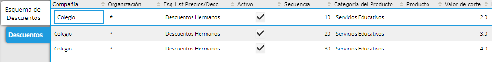

.. |Valor de Corte 5%| image:: resource/porcentaje-descuento-corte-5.png
.. |Valor de Corte 20%| image:: resource/porcentaje-descuento-corte-20.png
.. |Valor de Corte 30%| image:: resource/porcentaje-descuento-corte-30.png
.. |Ventana Esquema de Descuentos| image:: resource/discount-scheme-window.png

Definición de Descuentos
------------------------

Los descuentos pueden ser simples o tener cortes que le hacen variar el
porcentaje de descuento según una variable.

Esto se define en la ventana de Esquema de Descuento.

**Esquema de Descuento**
^^^^^^^^^^^^^^^^^^^^^^^^

Dentro de la Ventana “Esquema de Descuento” podremos observar todos los
diferentes tipos de descuento que tenemos.

-  El Tipo de Descuento “Porcentaje Simple” se definirá un único % de
   Descuento.

|Ventana Esquema de Descuentos|

-  El Tipo de Descuento de tipo “Corte” tendrán varios niveles dentro.

El Descuento llamado “Descuento Hermanos” es de tipo "Corte" en el cual
se deberá definir un % de Descuento según la Cantidad de Hermanos (Valor
de corte).

|Pestaña Descuentos|

A continuación se muestra el % de Descuento según el valor de corte de
cada uno.

|Valor de Corte 5%|

|Valor de Corte 20%|

|Valor de Corte 30%|