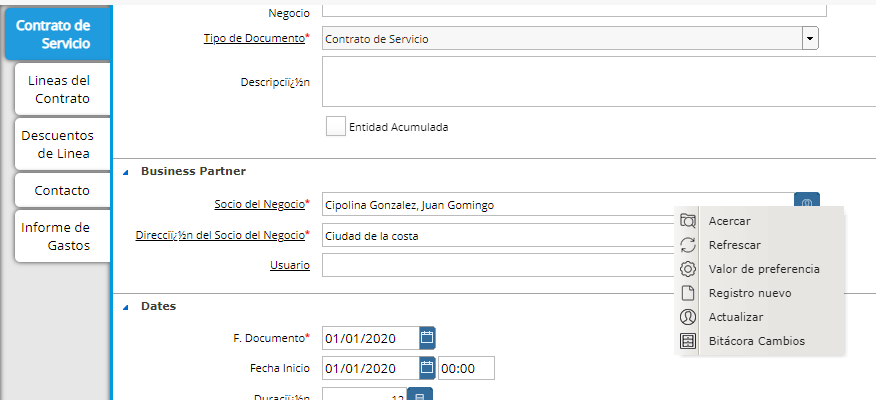

.. |Pestaña Miembro Ventana Familia| image:: resources/window-family-member-tab.png

Familia
=======

La Familia se crea como una agrupación donde dentro de la misma se
podrán encontrar sus correspondientes miembros junto con el vínculo que
los define (Padre, Madre, Hijo, Tutor).

Los Vínculos podrán ser parametrizados según sea necesario.

**Responsable de Pago:**

Es a quien se le emitirá las facturas de servicios.

Dentro de cada uno de los Miembros de la familia también se deberá
definir el check de “Responsable de Pago”. Sólo los Miembros que sean
Responsable de Pago podrán ser definidos como “Socio de Negocio Facturar
a” en el Contrato de Servicios de los alumnos. Por defecto se definirá
en una familia el check de Responsable de Pago al miembro que se defina
con el vínculo “Padre”. Esto podrá ser modificado.

Para poder ser definido como “Responsable de Pago” éste se deberá
definir como Socio del Negocio y también como Usuario. Usuario es el
contacto del Socio del Negocio, y un Socio del Negocio puede tener uno o
varios contactos usuarios.

El Responsable de Pago y los Alumnos deben ser Socio del Negocio, pues
solo ellos tendrán vínculos comerciales con la institución.

El esposo/a del Responsable de Pago no es necesario que sea Socio del
Negocio.

Código Familia: Número

Nombre de Familia: 2 Apellidos de la Familia

Descripción Familia: Si se desea

**Miembros (Pestaña)**

Los Miembros de la Familia del Tipo de Vínculo Estudiante y el
Responsable de Pago deben estar previamente ingresados como Socio del
Negocio.

|Pestaña Miembro Ventana Familia|

Para crear una nueva Familia se deberá seleccionar:

-  Socio del Negocio
-  Usuario
-  Vínculo: cómo se vincula a la Familia

   -  Hijo
   -  Padre
   -  Madre

Puede ingresar también los Miembros de la Familia desde el Contrato de
Servicios, posicionándose en Alumno, haciendo click derecho y
seleccionando Registro nuevo.

|Ventana Contrato de Servicio|

**Definir la cantidad de Hermanos en la Familia:**

Al momento de guardar un Socio del Negocio como Miembro de la Familia el
sistema verificará que el mismo sea de Tipo de Relación = “Hijo” y que
tenga un Contrato de Servicio creado en el sistema.

En ese momento se actualizará automáticamente en la Ventana Familia el
Campo “Hermanos”.

**Orden de Creación de Contratos Recomendado:**

-  Nombre Familia
-  Contrato

   -  Producto, Actividad

-  Desde Contrato se define:

   -  Socio del Negocio

      -  Nombre
      -  Cédula de Identidad
      -  Contacto

   -  Familia

-  Miembros de Familia