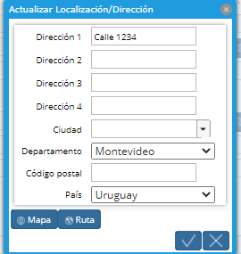
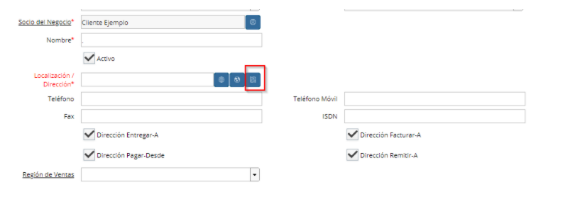

.. |Ventana Socio del Negocio| image:: resource/business-partner-window.png

Estudiantes
-----------

**Socio del Negocio**
~~~~~~~~~~~~~~~~~~~~~

Un Socio del Negocio corresponde a una entidad con la que se hacen
negocios. Hay tres tipos diferentes de Socios del Negocio:

-  Proveedores
-  Clientes
-  Empleados

En la vertical de Educación tanto el Estudiante como su Responsable de
Pago son considerados Socios del Negocio.

Grupo de Socio del Negocio (Campo)

Al Estudiante se recomienda definirlo en el campo Grupo de Socio del Negocio: “Estudiantes” así como
en los Familiares definir el Grupo de Socio del Negocio “Familiares”.

**NOTA: En el caso de los familiares Responsables de pago que realicen
el pago completo de la Anualidad por adelantado, se les deberá definir
el Grupo de Socio del Negocio “Familiar Anualidad”.**

Los **Grupos de Socios del Negocio** usados más frecuentemente son:

-  General
-  Estudiantes
-  Familiar
-  Familiar Anualidad
-  Proveedores

|Ventana Socio del Negocio|

Ejemplo de relleno de cabezal para un Estudiante:

-  Código: No. de Cédula de Identidad
-  Grupo de Impuestos: Cédula
-  Grupo de Socio del Negocio: Estudiante
-  Lista de Precios: Venta pesos para Estudiantes
-  Es Cliente: SI

**Pestaña Localización**
''''''''''''''''''''''''

Es obligatorio ingresar la localización (domicilio) en un Socio de
Negocio. Ingrese dónde está marcado.

|Pestaña Localización|

|Localización Dirección|