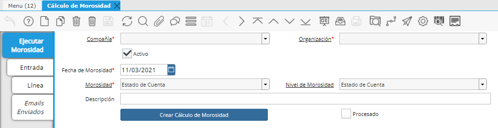

.. |Boton Crear Calculo de Morosidad| image:: resource/button-create-delinquency-calculation.png
.. |Proceso Crear Calculo de Morosidad| image:: resource/create-delinquency-calculation.png

.. |Pestaña Entrada| image:: resource/calculomorosidad2.png

Una vez se cuenta con toda la facturación ya generada se puede proceder
con la creación de los Estados de Cuenta de cada uno de los Responsables
de Pago.

Cálculo de Morosidad
~~~~~~~~~~~~~~~~~~~~

Para generar los Estados de Cuenta se deberá correr el proceso de
“Cálculo de Morosidad” desde la ventana “Cálculo de Morosidad”
seleccionando el Cálculo llamado “Estado de Cuenta”. Este tipo de
Morosidad tendrá el criterio de obtener todas las facturas que están
pendientes de Pago para ese momento, generando un registro en la pestaña
“Entrada” por cada Socio del Negocio que tenga al menos una factura
pendiente.

|Ventana Calculo de Morosidad|

Para generar los registros en el Cálculo de Morosidad deberá oprimir en
el botón de “Crear cálculo de Morosidad”.

|Boton Crear Calculo de Morosidad|

Al oprimir el botón se desplegará una ventana del proceso donde se
deberán seleccionar los criterios o filtros del proceso a generar. En
este caso se deberá definir la Organización, el Agente Comercial la
Moneda, la fecha (definir un día más de la fecha de facturas) de las
facturas que se desean filtrar y la Morosidad (Estado de Cuenta) de los
Socios de Negocio.

Como resultado le deberá responder la cantidad de entradas que se
generaron en el Estado de Cuenta.

|Proceso Crear Calculo de Morosidad|

Luego de correr el proceso podrá ir a las Entradas para ver todos los
registros encontrados.

|Pestaña Entrada|

Dentro de cada Registro en la pestaña “Entrada” se podrá obtener el
Reporte de “Estado de Cuenta” oprimiendo desde los procesos de la Barra
de Herramientas.