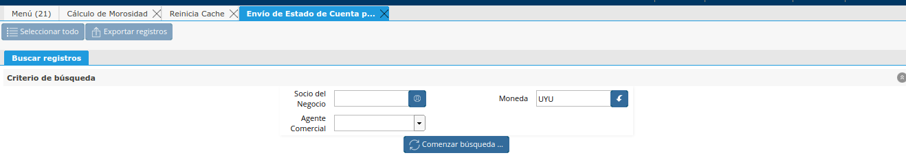
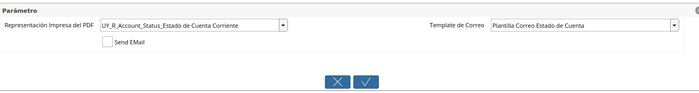

Envío masivo de Estado de Cuenta
--------------------------------

Una vez se generaron todas las entradas en el cálculo de morosidad
“Estado de Cuenta” se podrá ir al Proceso de Envío de Estado de Cuenta
por Correo”.

En este proceso se deberá definir los filtros deseados y se buscará las
Entradas de “Estado de Cuenta” que se desea enviar mediante correo.

|Sb Envio de Estado de Cuenta por Mail|

Luego de seleccionar los Estados de Cuenta que se desean enviar, se debe
seleccionar en los Parámetros del Proceso los criterios de envío.

Dentro de los criterios podemos seleccionar:

**Representación Impresa del PDF:** Formato de Impresión definido para
el Estado de Cuenta. Esto por el momento será fijo para todos los
estados de cuenta.

**Template de Correo:** Definición de la Plantilla de correo que se
enviará como texto en el correo.

**Check de “Send EMail”:** Este check podrá ser desmarcado para realizar
pruebas de envios sin enviar realmente el correo al Socio del Negocio.
Este envio se pdorá visualizar en la ventana de Bitácora de Emails. Si
se define el check en “Y” se enviará también el correo a los usuarios
definidos como que se envie mail en la Familia del Responsable de Pago.

|Parametros Envio de Estado de Cuenta por Mail|