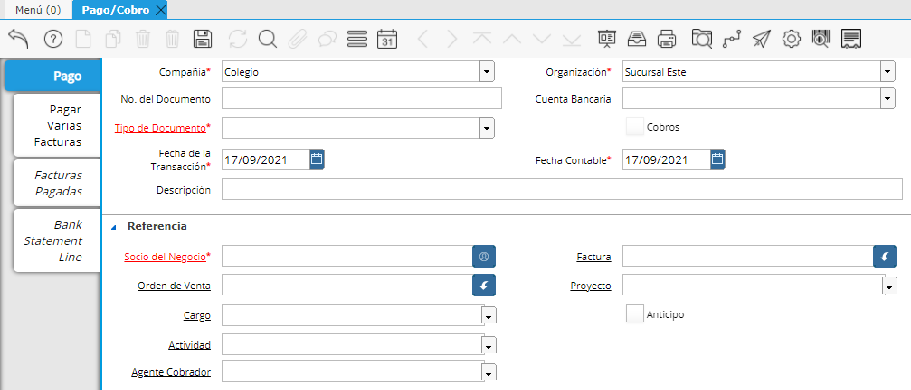

.. |Seccion Documento| image:: resources/document-section.png
.. |Seccion de Totales| image:: resources/totals-section.png

**Cobro por anticipo (Anualidad)**
==================================

Cuando un Responsable de Pago genera un pago por anticipado de la
anualidad completa de un Contrato de Servicio, se debe generar un Cobro
marcando el check de "Anticipo".

Para realizar un Cobro de Anualidad se deberá ingresar a la ventana
Pago/Cobro.

|Ventana Pago Cobro|

En el cabezal de la ventana deberemos indicar:

-  Tipo de Documento: Cobro.
-  Socio del negocio: Se deberá ingresar el cliente a quién se le
   cobrará.
-  **Es importante indicar aquí también el check de Anticipo ya que es
   lo que diferenciará a este documento de otro tipo de Pago/Cobro.**

En la sección Totales deberemos definir el Importe del cobro en el
campo “Total del pago” además de la Moneda en cuestión.

|Seccion de Totales|

Por último en la sección Documento seleccionaremos en el campo Tipo de
pago el medio de pago con el que le cobraremos al cliente, además de los
campos relacionados a éste.

|Seccion Documento|

Luego de esto podemos proceder a completar el documento seleccionando el
botón Completar.