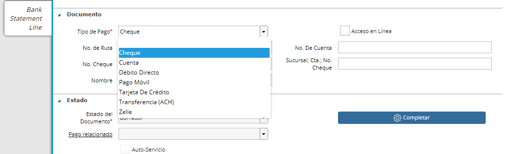

.. |Seccion de Totales| image:: resource/totals-section.png
.. |Ventana Pago Cobro| image:: resource/ventana-pago-cobro.png

Cobros de Anualidad
~~~~~~~~~~~~~~~~~~~

Es un documento que la Institución Educativa emite indicando que cobró a
un tercero un Documento por Cobrar correspondiente al pago completo de
la Anualidad por adelantado.

Para realizar un Cobro de Anualidad se deberá ingresar a la ventana
Pago/Cobro.

|Ventana Pago Cobro|

En el cabezal de la ventana deberemos indicar:

-  Tipo de Documento: Cobro.
-  Socio del negocio: Se deberá ingresar el cliente a quién se le
   cobrará.
-  En el campo Factura deberemos seleccionar la factura a cobrar.
-  **Es importante indicar aquí también el check de Anticipo ya que es
   lo que diferenciará a este documento de otro tipo de Pago/Cobro.**

En la sección Totales deberemos definir los Importes del cobro además de
la Moneda.

|Seccion de Totales|

Por último en la sección Documento seleccionaremos en el campo Tipo de
pago el medio de pago con el que le cobraremos al cliente, además de los
campos relacionados a éste.

|Seccion Documento|

Luego de esto podemos proceder a completar el documento seleccionando el
botón Completar.