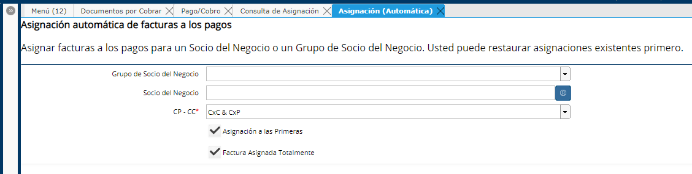

Asignación (Automática)
=======================

El proceso de Asignación automática permite generar de manera masiva
asignaciones entre Facturas con Saldo Abierto contra Pago/Cobro que aún
no estén asignados.

|Asignacion Automatica|

Filtros:
--------

-  Grupo de Socio del Negocio: Seleccionar un Grupo de Socio del Negocio
   para que se genere el proceso sólo para ellos.
-  Socio del Negocio: Seleccionar un Socio del Negocio para que genere
   el proceso sólo para documentos de dicho Socio del Negocio.
-  Cuentas por Pagar - Cuentas por Cobrar: Se permite elegir Cuentas por
   Pagar (CxP), cuentas por Cobrar (CxC) o ambos.

Criterios:
----------

-  Asignación a las Primeras: el proceso generara las asignaciones
   consultando los documentos por orden cronológico desde el más viejo
   al mas nuevo.
-  Factura Asignada totalmente: Sólo se generará la asignación si la
   Factura en cuestión quede totalmente asignada. En caso de no quedar
   completamente asignada no se genera asignación ninguna, quedando
   tanto la factura como el Pago con saldo abierto. El proceso no
   generará ninguna asignación parcial.

Descripción:
------------

Cada Asignación generada desde el proceso de Asignación (Automático)
tendrá definido en su Descripción el texto de "Asignación Auto"

Preguntas Frecuentes
--------------------

El proceso de Asignación (automático) considera Notas de Crédito?

No, el proceso sólo generará asignaciones entre Facturas y Pagos

El proceso de Asignación (automático) considera Documentos por Pagar
contra Documentos por Cobrar?

No, el proceso sólo considerará DxC con Cobros y DxP contra Pagos.