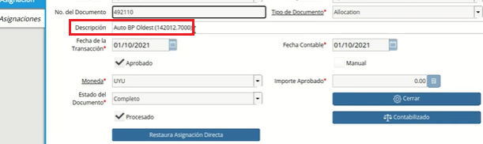
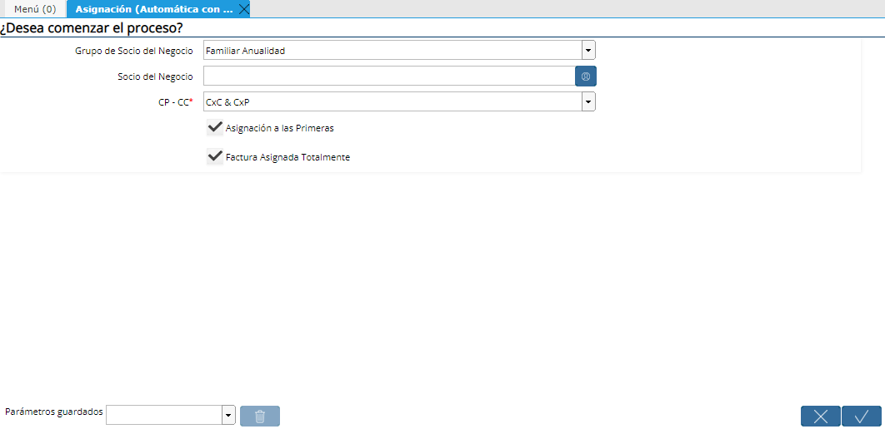
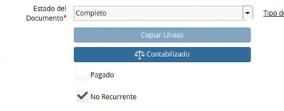
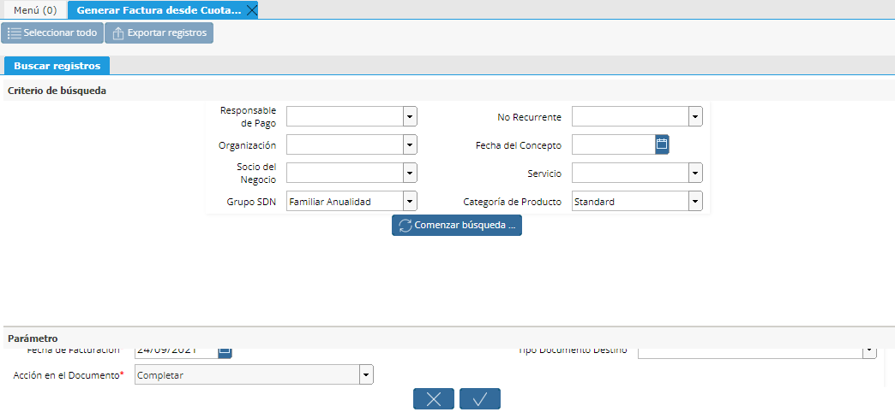
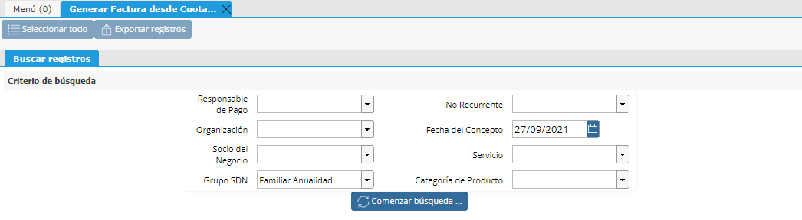
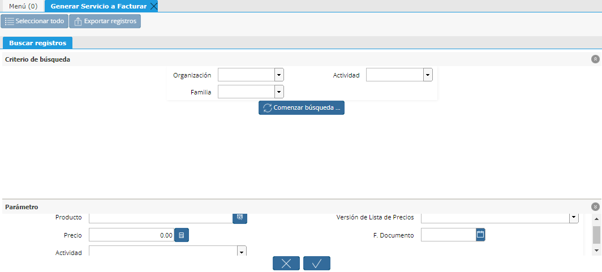

Asignación Masiva Automática con Exclusión
==========================================

Para realizar una Asignación Masiva Automática con Exclusión se deberán
seguir los siguientes pasos:

1. Generar Servicio a Facturar de SDN con ANUALIDAD
---------------------------------------------------

**NOTA:** Para visualizar los Socios del Negocio con anualidad podemos
ir al proceso Generar factura desde cuota de contrato. En los filtros
vamos a definir la opción "Familiar Anualidad"  en el campo "Grupo SDN"
y la fecha en cuestión en el campo "Fecha del concepto". Luego
generaremos la búsqueda smartbrowser.

|Generar Factura desde Cuota de Contrato Sb|

Desde el Proceso **Generar Servicio a Facturar** generaremos los
servicios a Facturar No Recurrentes filtrando por las Familias
correspondientes a los Socios del Negocio que filtramos anteriormente.

(Este proceso ya está explicado en la guía de Facturación de servicios).

|Generar Servicio a Facturar|

2. Generar Servicio a Facturar de SDN sin ANUALIDAD
---------------------------------------------------

De igual forma generaremos los servicios a Facturar No Recurrentes
filtrando por las Familias correspondiente a los Socios del Negocio que
pagan de forma mensual.

3. Proceso Generar factura desde Cuota de contrato (Anualidades)
----------------------------------------------------------------

En el caso de las ANUALIDADES es IMPORTANTE que se facture primero un
servicio recurrente y luego el NO recurrente, o viceversa, es decir,
**no importa el orden pero si que se facturen por separado**.

En el filtro Grupo SDN deberemos indicar "Familiar Anualidad".

|Generar Factura desde Cuota de Contrato|

4. Verificar check de "No Recurrente" en DxC
--------------------------------------------

Luego de generar las facturas es importante corroborar el check de "No
Recurrente" en los Documentos por cobrar ya que éstas no deberán ser
tomadas en cuenta posteriormente en el proceso de Asignación Automático
(Con exclusión).

|Check No Recurrente en Factura|

5. Correr proceso de "Asignación Automático (Con exclusión)"
------------------------------------------------------------

Por último procederemos a correr el proceso Asignación (Asignación
Automática con Exclusión).

Este proceso asignará únicamente las facturas cuyos servicios sean
RECURRENTES y se debe utilizar para el Grupo SDN "Familiar Anualidad",
por lo que indicaremos esta opción en los filtros del proceso.

En el caso que se desee hacerlo para un Socio de negocio en particular
este se define también en el filtro Socio del negocio.

|Asignación Automatica con Exclusion|

Al generar la Asignación si navegamos a la factura en cuestión va a
tener el check Pagado en "Y".

Luego si navegamos a la asignación desde la pestaña Facturas pagadas
veremos que la misma informará en el campo "Descripción", que esta se
hizo automáticamente. En la pestaña Asignaciones de esta ventana veremos
que este Pago se canceló con la Factura generada.

|Ventana Consulta de Asignación|

Si voy a la factura NO RECURRENTE puedo corroborar que esta no quedó
paga aún, lo mismo podemos verificar en el reporte de Saldos pendientes.