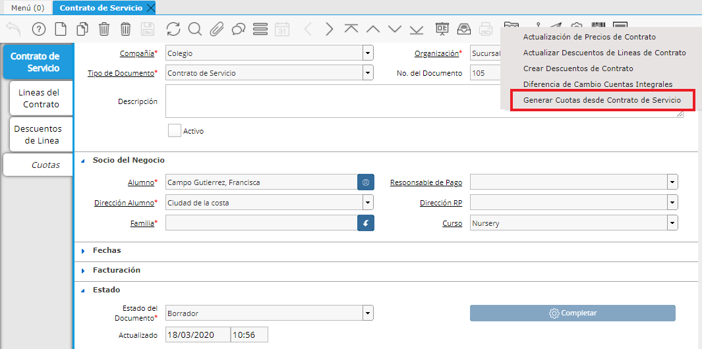
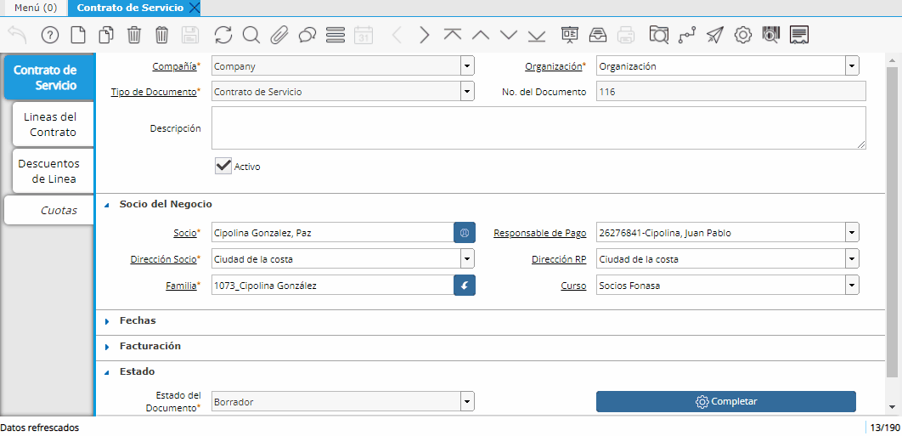

.. |Generar Cuotas desde Contrato de Servicio| image:: resource/generar-cuotas-desde-contrato-de-servicio.png

.. |Proceso Masivo| image:: resource/proceso-masivo.png

A partir de los Contratos de Servicios y de la definición de sus Líneas
se puede generar las Cuotas correspondientes según los Servicios
Recurrentes definidos. De esta manera se podrán generar las Cuotas a
Facturar según la recurrencia definidas en los Contratos.

Las “Cuotas de Contratos” generadas quedarán vinculadas al Contrato de
Servicio en Estado “Completo” y se podrá visualizar las mismas desde la
pestaña “Cuotas del Contrato”

Este proceso se puede realizar para un contrato o para todos los
contratos. Podrá encontrar el Proceso tanto desde el Contrato de
Servicio como también desde el Menú.

Proceso para un Contrato en específico
^^^^^^^^^^^^^^^^^^^^^^^^^^^^^^^^^^^^^^

-  **Para correr este proceso para un contrato en específico lo haremos
   desde el cabezal del contrato, seleccionando el ícono de la tuerca y
   luego "Generar cuotas desde Contrato de Servicio".**

|Proceso Barra Herramientas|

Luego en el campo Contrato deberemos seleccionar el Contrato en
cuestión, (por defecto el sistema indica en este campo el Contrato en el
que me encuentro).

**Check "Línea Descuento Aparte":**

Si se marca el check "Línea Descuento Aparte", el sistema creará en la
pestaña Cuotas una línea por cada Cuota y debajo de cada una generará
otra por su correspondiente descuento (en caso de tenerlo).

|Generar Cuotas desde Contrato de Servicio|

**NOTA:** Las “Cuotas de Contratos” generadas quedarán vinculadas al
Contrato de Servicio en Estado “Completo”. Se podrá visualizar las
mismas desde la pestaña “Cuotas del Contrato”.

Ejemplo del proceso:

|Gif Proceso|

Proceso para varios Contratos a la vez
^^^^^^^^^^^^^^^^^^^^^^^^^^^^^^^^^^^^^^

-  **Si deseamos generar cuotas para varios contratos a la vez
   correremos el proceso de forma masiva desde el menú dejando el campo
   "Contrato" vacío y seleccionando o no (a elección) el check "Línea
   Descuento Aparte".**

|Proceso Masivo|

**¿Cómo corregir o anular una Cuota de Contrato?**
^^^^^^^^^^^^^^^^^^^^^^^^^^^^^^^^^^^^^^^^^^^^^^^^^^

-  Para corregir una Cuota de Contrato deberá dirigirse al Informe de
   gastos generado por la Cuota, presionar el botón de Acción del
   Documento y **Cerrar el Documento.**

El Documento pasará al estado **Cerrado.**

Luego deberá ejecutar nuevamente desde el cabezal el proceso de Generar
Cuotas desde Contrato de Servicio.

Ejecutará todas las líneas del contrato que no tengan documentos
completos.

-  Para anular una Cuota de Contrato el proceso es similar.

Deberá dirigirse al Informe de gastos generado por la Cuota, presionar
el botón de Acción del Documento y **Anular el Documento.**

El Documento pasará al estado **Anulado.**

Luego deberá ejecutar nuevamente desde el cabezal el proceso de Generar
Cuotas desde Contrato de Servicio.

Ejecutará todas las líneas del contrato que no tengan documentos
completos.