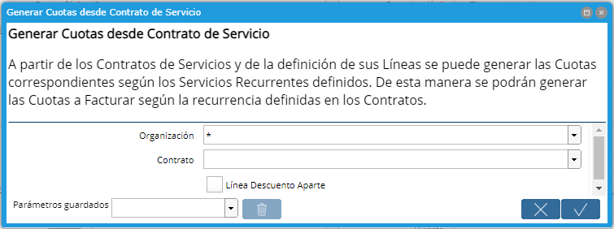

.. |Proceso Barra Herramientas| image:: resources/cabezal.png

.. |Proceso Masivo| image:: resources/proceso-masivo.png

**Generación de Cuotas desde el Contrato de Servicio**
======================================================

A partir de los Contratos de Servicios y de la definición de sus Líneas
se puede generar las Cuotas correspondientes según los Servicios
Recurrentes definidos.

De esta manera se podrán generar las Cuotas a Facturar según la
recurrencia definidas en los Contratos.

Las “Cuotas de Contratos” generadas quedarán vinculadas al Contrato de
Servicio en Estado “Completo”. Se podrá visualizar las mismas desde la
pestaña “Cuotas del Contrato”

Este proceso se puede realizar para un contrato o de forma masiva para
todos los contratos. Podrá encontrar el Proceso tanto desde el Contrato
de Servicio como también desde el Menú.

**Proceso para un Contrato en específico**
------------------------------------------

-  Podrá correr el Proceso desde el cabezal de un Contrato de Servicio
   seleccionando el ícono de la tuerca y luego la opción "Generar Cuotas
   desde Contrato de Servicio".

|Proceso Barra Herramientas|

Luego en el campo Contrato deberemos seleccionar el Contrato en
cuestión, (por defecto el sistema indica en este campo el Contrato en el
que me encuentro).

|Generar Cuotas desde Contrato de Servicio|

**Check "Línea Descuento Aparte":**

Si se marca el check "Línea Descuento Aparte", el sistema creará en la
pestaña Cuotas una línea por cada Cuota y debajo de cada una generará
otra por su correspondiente descuento (en caso de tenerlo).

**NOTA:** Las “Cuotas de Contratos” generadas quedarán vinculadas al
Contrato de Servicio en Estado “Completo”. Se podrá visualizar las
mismas desde la pestaña “Cuotas del Contrato”.

Ejemplo del proceso:

.. only:: html

    .. figure:: resources/gif-proceso.gif

    Video 1. Gif del Proceso

**Proceso para varios Contratos a la vez**
------------------------------------------

-  También se podrá correr este proceso de forma masiva desde el Menú,
   desde el proceso “Generar Cuotas a Facturar desde Contrato”. En este
   caso podrá no seleccionar ningún Contrato de Servicios en especial
   generando así Cuotas para Todos los Contratos.

|Proceso Masivo|

En el caso que se haya utilizado la opción de "Linea Descuento Aparte" al crear el contrato, deberá marcarse este check para correr el proceso.

**¿Cómo corregir o anular una Cuota de Contrato?**
--------------------------------------------------

-  Para corregir una Cuota de Contrato deberá dirigirse al Informe de
   gastos generado por la Cuota, presionar el botón de Acción del
   Documento y **Cerrar el Documento.**

El Documento pasará al estado **Cerrado.**

Luego deberá ejecutar nuevamente desde el cabezal el proceso de Generar
Cuotas desde Contrato de Servicio.

Ejecutará todas las líneas del contrato que no tengan documentos
completos.

-  Para anular una Cuota de Contrato el proceso es similar.

Deberá dirigirse al Informe de gastos generado por la Cuota, presionar
el botón de Acción del Documento y **Anular el Documento.**

El Documento pasará al estado **Anulado.**

Luego deberá ejecutar nuevamente desde el cabezal el proceso de Generar
Cuotas desde Contrato de Servicio.

Ejecutará todas las líneas del contrato que no tengan documentos
completos.