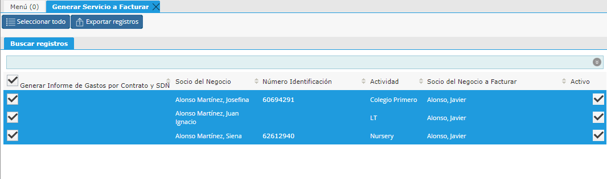

.. |Gif del Proceso| image:: resource/gif-del-proceso-.png
.. |Parametros del Proceso| image:: resource/parametros-proceso-.png
.. |Sb Generar Servicio a Facturar| image:: resource/sb-generar-servicio-a-facturar-.png

Generar Concepto a Facturar no Recurrente
-----------------------------------------

Para la generación de Servicios a Facturar que no son recurrentes, es
decir como por ejemplo Natación, Talleres, etc, se podrá utilizar el
proceso de “Generar Servicio a Facturar”.

Mediante este Navegador se podrá visualizar los contratos de servicio
sobre los cuáles se desea generar el Servicio a Facturar. Opcionalmente
podrá definir un filtro para seleccionar que Contratos visualizar,
dentro de los filtros posibles se encuentra la Organización, la
Actividad y la Familia. De esta manera si se desea generar un servicio
de “Taller” a todos los contratos de una familia por ejemplo,
simplemente puede aplicar el filtro correspondiente y sólo se presentará
la familia seleccionada.

|Sb Generar Servicio a Facturar|

Una vez con todos los contratos filtrados pueden marcar todos o
desmarcar si en algún caso no aplica.

|Seleccionar Lineas|

Una vez seleccionados los Contratos sobre los que se desea generar el
“Servicio a Facturar” se deberá definir en los Parámetros del Proceso el
Servicio que se desea generar.

|Parametros del Proceso|

| Se debe definir el Producto y la Versión de lista de precios deseada.
  El precio será tomado según el Precio de lista que tiene definido el
  Producto en la versión de lista de precios seleccionada. En caso que
  se desee definir un precio específico y no el definido en la lista de
  precios podrá definir el mismo en el campo “Precio”. Si este campo
  “Precio” queda en 0 el proceso tomará por defecto el precio de lista
  de la versión definida. 
| Para generar el Servicio a facturar se deberá definir la Fecha y la
  actividad (Definir la misma que el producto para reportes Contables).
  La Fecha se recomienda definir el primer día del mes así cuando se
  generan las facturas se puede filtrar por todos los servicios con
  fecha 1ro del mes y así le aparecerá estos servicios también.

A continuación presentamos un gif con un ejemplo del proceso:

|Gif del Proceso|