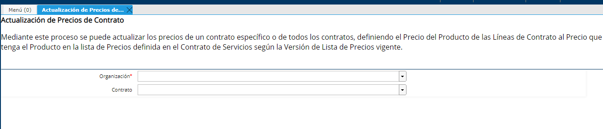

.. |Campo Lista de Precios Ventana SDN| image:: resources/lista-de-precios-ventana-socio-del-negocio-.png

.. |Proceso desde Barra de Herramientas| image:: resources/proceso-actualizacion-de-precios-del-contrato-barra-de-herramientas-.png
.. |Pestaña Version Ventana Lista de Precios| image:: resources/version-de-lista-de-precios-.png

**Actualización de Precios**
============================

**Listas de Precio**
~~~~~~~~~~~~~~~~~~~~

Existen Listas de Precios de Venta y de Compra, y a cada Socio del
Negocio se le debe definir una. A los Alumnos, como son considerados
Clientes se le debe definir en el cabezal de la ventana Socio de Negocio
la Lista de Precios “Venta Pesos”

|Campo Lista de Precios Ventana SDN|

**Versiones de Listas de Precios**
~~~~~~~~~~~~~~~~~~~~~~~~~~~~~~~~~~

A su vez existen versiones de una Lista de Precios, por ejemplo:

Lista de Precios Venta Pesos

|Pestaña Version Ventana Lista de Precios|

**Actualización de Precios del Contrato**
-----------------------------------------

Mediante este proceso se puede actualizar los precios de un contrato
específico o de todos los contratos, definiendo el Precio del Producto
de las Líneas de Contrato al Precio que tenga el Producto en la lista de
Precios definida en el Contrato de Servicios según la Versión de Lista
de Precios vigente.

En el caso que se hayan definido los descuentos desde la línea de
contrato, el nuevo precio calculado en la Línea del Contrato considera
el % de descuento establecido definiendo así el nuevo “Precio Neto” ya
con el Descuento incluido.

Este proceso se puede correr para un contrato específico o de todos los
contratos:

-  Se pueden actualizar los precios de un contrato específico
   presionando el ícono Procesos en la barra de herramientas, desde el
   cabezal de la ventana Contrato de Servicio.

|Proceso desde Barra de Herramientas|

-  También se puede correr el proceso de forma masiva para todos los
   contratos desde la ventana "Actualización de precios de contrato",
   dejando el campo "Contrato" vacío.

|Actualizacion de Precios de Contrato|