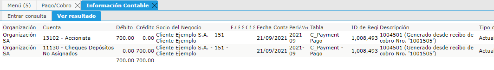
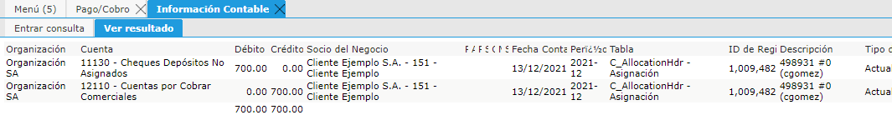

Cheques Depósito no Asignados (Activo)  11130
---------------------------------------------

El Saldo de esta cuenta representará el saldo actual de todos los Cobros
que ya fueron registrados pero que aún no fueron asignados a que
facturas estarían cancelando.

**Documento Cobro:**

La Cuenta Cheques Depositados sin Asignar es la cuenta que utiliza los
Cobros para dejar registro de que existió un Cobro que debería terminar
bajando el "Activo" del Documento por Cobrar pero que como aún no está
identificado (en el Documento "Cobro") no baja directamente la cuenta de
"Cuentas por Cobrar Comerciales".

Acción Contable Cobro:  Crédito (Haber)

|Credito Cobro|

Por esta razón, Solop utiliza una cuenta puente intermedia para que
luego otro documento (asiento) genere la correspondiente baja del Activo
de "Cuentas por Cobrar Comerciales" (Cuenta que movió realmente la
Factura pendiente) una vez sea Asignada la factura exacta que está
cancelando el Cobro.

**Documento Asignación:**

En el momento de la Asignación es cuando se define exactamente la
factura que se estará cancelando con el cobro/s en cuestión bajando
ahora el saldo del Activo que existía en la Factura por Cobrar,
cancelando también el saldo existente en la cuenta de "Cheques Depósitos
sin Asignar"

Acción Contable Asignación:  Débito (Debe)

|Debito Asignacion|

**Reporte Auxiliar de Cuenta: Pagos sin Asignar**

El reporte que explicará el saldo de la cuenta a nivel documental será
el "Pagos sin Asignar" filtrando por "Transacción de Ventas = SI" (ya
que sólo corresponde a los Cobros que aún no estén asignados.

Podrá realizar los siguientes pasos que le ayudará a comprender y
verificar el saldo de esta cuenta:

**Controles recomendados:**

Transacciones con una sola moneda
~~~~~~~~~~~~~~~~~~~~~~~~~~~~~~~~~

1. Emitir el Balance de Prueba de la cuenta contable "Cheques Depósito
   no Asignados" por Socio de Negocio.
2. Exportar con formato XLSX.
3. Identifique las contabilizaciones que correspondan a transacciones
   anuladas. Píntar las anuladas.
4. Sumar las filas identificadas y verificar que sumen 0.
5. Vincular Pagos con Asignaciones. Pintarlos. Verificar que sumen 0.
6. Vincular Cobros con Asignaciones. Pintarlos. Verificar que sumen 0.
7. Las transacciones que quedaron sin identificar corresponderá al saldo
   de la cuenta. Es decir a los Pagos/Cobros sin Asignar.
8. También podrá emitir el Reporte de Pagos sin Asignar (le mostrará los
   pagos no Asignados a la fecha , cualquier estado)

Transacciones en varias monedas
~~~~~~~~~~~~~~~~~~~~~~~~~~~~~~~

1. Emitir el Balance de Prueba de la cuenta contable "Cheques Depósito
   no Asignados" por Socio de Negocio y Moneda.
2. Exportar con formato XLSX.
3. Identifique las contabilizaciones que correspondan a transacciones
   anuladas. Píntar las anuladas.
4. Sumar las filas identificadas y verificar que sumen 0.
5. Vincular Pagos con Asignaciones. Pintarlos. Verificar que sumen 0.
6. Vincular Cobros con Asignaciones. Pintarlos. Verificar que sumen 0. 
7. Las transacciones que quedaron sin identificar corresponderá al saldo de la cuenta. Es decir a los
Pagos/Cobros sin Asignar.