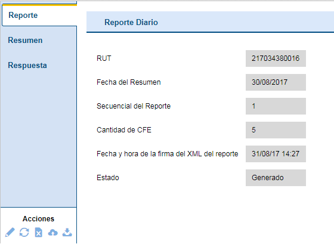
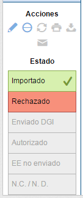
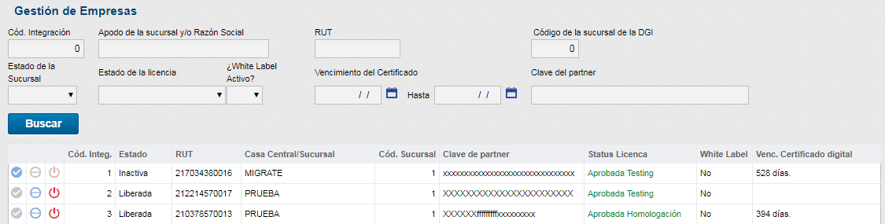
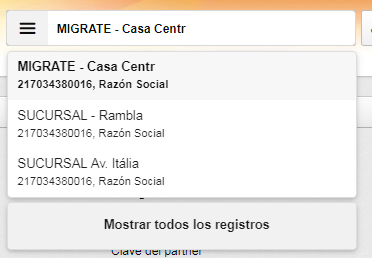
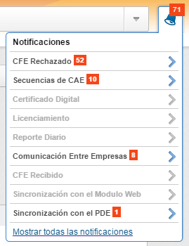
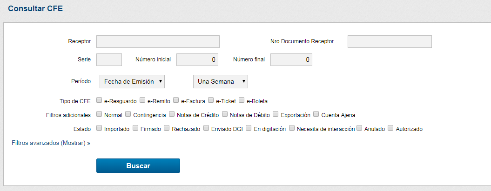

.. |Acciones Detalles del CFE| image:: resource/acciones-detalles-del-cfe.png
.. |Acciones sobre CFE Recibido| image:: resource/acciones-sobre-cfe-recibido.png
.. |CFE Recibidos| image:: resource/cfe-recibidos.png
.. |Comprobantes Fiscales Filtrados| image:: resource/comprobantes-fiscales-filtrados.png
.. |Consultar CFE| image:: resource/consultar-cfe-boton.png

.. |Detalle de CFE Recibido| image:: resource/detalle-de-cfe-recibido.png
.. |Detalles del CFE| image:: resource/detalles-del-cfe.png
.. |Estado del CFE Enviado a DGI| image:: resource/estado-del-cfe-1.png

.. |Exhibir todas las Notificaciones| image:: resource/exhibir-todas-las-notificaciones.png
.. |Generacion del Reporte Diario| image:: resource/generación-del-reporte-diario.png

.. |Icono Actualizar| image:: resource/icono-actualizar.png
.. |Icono Descargar XML| image:: resource/icono-descargar-xml.png
.. |Icono Descargar| image:: resource/icono-descargar.png

.. |Icono Eliminar| image:: resource/icono-eliminar.png

.. |Icono Imprimir Copia CFE| image:: resource/icono-imprimir-copia-cfe.png
.. |Icono Notificacion Leida| image:: resource/icono-notificacion-leida.png
.. |Icono Notificaciones con Marca| image:: resource/icono-notificaciones-con-marca.png
.. |Icono Notificaciones| image:: resource/icono-notificaciones.png

.. |Lista CFE emitidos a la Fecha| image:: resource/lista-cfe-emitidos-a-la-fecha.png

.. |Lista de Reportes Diarios| image:: resource/lista-de-reportes-diarios.png
.. |Notificaciones del Sistema| image:: resource/notificaciones-del-sistema.png

.. |Otros Tipos de Documento| image:: resource/otros-tipos-de-documento.png
.. |Reportes| image:: resource/reportes.png

**Invoicy - Plataforma Facturación Electrónica**
~~~~~~~~~~~~~~~~~~~~~~~~~~~~~~~~~~~~~~~~~~~~~~~~

**Validación de datos en InvoiCy:**
^^^^^^^^^^^^^^^^^^^^^^^^^^^^^^^^^^^

Luego de completado un e-Ticket/e-Factura, se puede chequear el CFE
emitido en InvoiCy (http://openupsolutions.invoicy.com.uy), e ingresando
con los datos proporcionados por OpenUp.

Se despliega la página donde se puede ver la lista de todos los CFE
(Comprobante Fiscal Electrónico) emitidos a la fecha:

|Lista CFE emitidos a la Fecha|

En esta ventana y hacia la derecha de cada registro encontrará el icono
de impresora y desde ahí también seleccionar el medio (A4, rollo de 80mm) e imprimir.

Haciendo clic en cualquiera de las líneas mostradas, se verá los
detalles del documento igual a como se puede apreciar en la
representación impresa, organizado por pestañas:

|Detalles del CFE|

De igual forma se puede chequear para cada documento detalles como los
totales, impuestos, descuentos, etc.

Finalmente, y en la parte inferior de la ventana de la ventana, hay
controles que permiten realizar diferentes acciones:

|Acciones Detalles del CFE|

-  Anular un CFE
-  Actualizarlo
-  Imprimirlo
-  Descargar el XML
-  Re-enviar archivos por e-mail.

**Estado del CFE:**
^^^^^^^^^^^^^^^^^^^

Finalmente en esta parte, se encuentra el “Estado” de los CFE:

|Estado del CFE Enviado a DGI|

En el caso de un documento hubiera sido rechazado, es posible desde ahí
editarlo para intentar el reenvío:

|Estado del CFE Rechazado|

Utilizando el lápiz se puede editar el documento para volver a intentar
el envío. Sugerimos buscar apoyo en nuestro soporte para validar la
información antes de intentar cualquier cambio.

Si la empresa a la que se le está facturando también está en el sistema
de Facturación Electrónica InvoiCy envía una copia del documento por
email a esta Empresa y una copia a DGI.

**Otros tipos de documentos:**
^^^^^^^^^^^^^^^^^^^^^^^^^^^^^^

También se puede consultar otros tipos de documentos, para verlos, en la
ventana “Inicio” se pasa el mouse por encima de la barra que da acceso a
filtros inmediatos de “Tipo” “Número”, “Fecha” y “Estado” y se selecciona:

|Otros Tipos de Documento|

De igual forma, si se necesita hacer un filtro más preciso, se puede
seleccionar

|Consultar CFE|

y desde ahí se ingresa los valores necesarios para el filtro:

|Consultar CFE 2|

Aquí se puede filtrar la información a fin de encontrar algún registro
en particular, especialmente:

Serie.

-  Número inicial y final.
-  Periodo de tiempo
-  Tipo de CFE

Con lo cual al filtrar se puede obtener una cantidad limitada de
registros a consultar y así ubicar una información más rápidamente:

|Comprobantes Fiscales Filtrados|

Al hacer clic en alguno de los campos de cualquier fila, se abre el
documento mostrando sus detalles organizados en pestañas.

Reportes de CFE:
^^^^^^^^^^^^^^^^

|Reportes|

Para acceder a la pantalla de los reportes diarios se debe hacer clic
sobre el botón “Reporte Diario” en la pantalla de Reportes.

|Lista de Reportes Diarios|

De igual forma, se puede filtrar la información, similar a como se hizo
con los documentos CFE (filtrar estado, fechas)

Luego de colocar los filtros, se hace clic en el botón “Generar Reporte
Diario”. Se abrirá la siguiente pantalla:

|Generacion del Reporte Diario|

En esta pantalla basta especificar la fecha del reporte diario deseado y
hacer clic en el botón “Generar” para que el reporte sea generado.
Haciendo clic en el botón “Volver” la pantalla será cerrada y podrá ser
observado en la parte superior de la tabla, el nuevo reporte diario.

Este reporte se puede

-  Editar

|Icono Editar|

-  Actualizar

|Icono Actualizar|

-  Eliminar

|Icono Eliminar|

-  Enviar reporte a DGI

|Icono Enviar Reporte a DGI|

-  Descargar

|Icono Descargar|

Al hacer clic en uno de los campos, se abrirá una pantalla donde estarán
disponibles tres pestañas con los datos del reporte:

|Datos del Reporte|

La pantalla de edición del reporte fue creada para solucionar problemas
de emisión del  reporte cuando los comprobantes que están en InvoiCy
fueran emitidos erróneamente, y debe ser utilizada con cautela. En
general, InvoiCy genera un reporte diario correctamente a partir de las
informaciones de los CFE emitidos.

Cuando el reporte diario es rechazado, busque la orientación de nuestro
soporte antes de editar la información del reporte e intentar
reenviarlo, pues, probablemente el problema está en los CFE emitidos y
estos deben ser corregidos antes del reporte en sí.

**CFE Recibidos:**
^^^^^^^^^^^^^^^^^^

En la pantalla de CFE recibidos serán mostrados todos los CFE emitidos
para el RUT de la empresa, como muestra la figura más adelante:

|CFE Recibidos|

Esta pantalla presenta los siguientes filtros:

-  Tipo CFE
-  Serie
-  Número
-  Fecha Inicial y Fecha Final: Correspondiente a fecha de emisión,
   firma o de importación
-  RUT del emisor
-  Emisor
-  Estado del Sobre: Informa los posibles estados del sobre: sobre
   recibido o sobre rechazado
-  Estado de la Respuesta: Pone a disposición los estados de la
   respuesta al CFE: No Respondido, Confirmado o Rechazado
-  Número Secuencial Único.

Para ver los detalles de los CFE recibidos, hay que hacer clic sobre el
link que se presenta al colocar el puntero del mouse sobre los registros
mostrados en la cuadrícula.

|Detalle de CFE Recibido|

Al final se mostrará una lista de Acciones sobre el CFE, así como el
“Estado” del CFE:

|Acciones sobre CFE Recibido|

-  Descargar XML

|Icono Descargar XML|

-  Imprimir una copia de la rep impresa del CFE

|Icono Imprimir Copia CFE|

-  Re-enviar e-mail con los archivos de Aceptación y Acuse de Recibo.

|Icono Enviar Mail|

Lista de Empresas/Sucursales:

Para gestionar las empresas/sucursales registradas en InvoiCy, se puede
utilizar la lista de empresas contenida en la parte superior de la
pantalla del sistema, que se muestra en la siguiente imagen:

|Lista de Empresas|

La primera empresa que aparece en la lista es la empresa que está
actualmente seleccionada, al colocar el cursor del mouse y hacer un
clic, ésta se expandirá y mostrará, en orden alfabética todas las
empresas que a la que tiene acceso.

También es posible digitar para buscar una casa principal o sucursal. El
contenido de esa  lista puede ser cambiado haciendo clic en “Mostrar
todos los registros”, la siguiente imagen muestra la pantalla que será
exhibida:

|Gestion de Empresas|

**Notificaciones en InvoiCy:**
^^^^^^^^^^^^^^^^^^^^^^^^^^^^^^

InvoiCy posee un sistema de notificaciones para las más variadas
situaciones del sistema. El ícono de las notificaciones se encuentra en
el encabezado de la pantalla del sistema, como muestra la siguiente
imagen:

|Icono Notificaciones|

Cuando alguna situación genera notificaciones, el icono de
notificaciones tendrá una pequeña marca, como muestra la siguiente
imagen:

|Icono Notificaciones con Marca|

Al pasar el cursor del mouse sobre ese ícono, se abrirá una ventana
mostrando las notificaciones por grupo, como muestra la siguiente
figura:

|Notificaciones por Grupo|

La notificación puede ser marcada como leída haciendo clic en siguiente
botón:

|Icono Notificacion Leida|

Si se hace un clic en la notificación, lo llevará a la pantalla de
InvoiCy, donde se podrá corregir o ejecutar alguna acción.

Para exhibir todas las notificaciones, se debe hacer clic en el link
“Exhibir todas las notificaciones”:

|Exhibir todas las Notificaciones|

La siguiente imagen muestra la pantalla con todas las notificaciones del
sistema, su fecha de generación, su estado, su categoría y su
descripción completa.

|Notificaciones del Sistema|

En la columna acciones, están las opciones:

Con este botón se marca la notificación como leída.

|Icono Notificacion Leida|

Con este botón se abrirá una nueva pantalla que posibilita solucionar el
problema que generó la notificación.

|Icono Solucionar Problema que Genero Notificacion|

