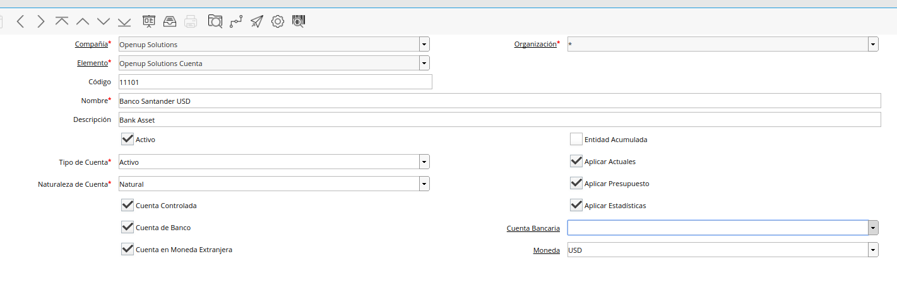

.. |Diferencia de Cambio Cuentas Integrales| image:: resources/diferencia-cambio-integrales.png

**Proceso de Revaluación de Cuentas Integrales - Cuentas Monetarias**
=====================================================================

Este Proceso tomará todas las Cuentas Contables Integrales definidas
como Moneda Extranjera considerando la moneda que tenga definida dicha
Cuenta Contable.

Abajo se muestra la parametrización que debe tener el elemento contable
para que esta Cuenta Contable sea considerada en el Proceso de
Revaluación de Cuentas Integrales.

-  Cuenta de Banco: SI
-  Cuenta en Moneda Extranjera: SI
-  Moneda: USD

|Proceso Revaluacion Cuentas Integrales|

No tomará las diferencias que existan en Cuentas Contables Integrales
que sean afectadas por Documentos por Pagar o Documentos por Cobrar.

(Estas diferencias serán ajustadas desde el proceso de Diferencia de
cambio No Realizada de Documentos a Pagar y Cobrar).

|Diferencia de Cambio Cuentas Integrales|

Monedas: moneda a considerar en revaluación

Revalorización Tipo de Documento: donde genera el asiento de revaluación

Tipo de Conversión: Tipo Conversión utilizada en el proceso

Revalorización Tipo de Documento: GL (General Ledger) donde genera el
asiento de revaluación

Comprobación del Proceso de Diferencia de Cambio de Cuentas Monetarias
----------------------------------------------------------------------

Compare el saldo  actual (en la moneda esquema) de las cuentas contables
monetarias y el saldo que debería tener a la fecha de cierre del Período
como producto de multiplicar los saldos en moneda extranjera por la Tasa
de Cambio de cierre del Período.

Ese producto debería ser el valor de la diferencia de cambio.

.. raw:: html

   <table>

.. raw:: html

   <tbody>

.. raw:: html

   <tr>

.. raw:: html

   <td>

.. raw:: html

   

La emisión del Reporte genera un Asiento Contable en estado borrador con
la Descripción Diferencia de Cambio Cuentas Integrales, detallando línea
a línea los ajustes que se estarían realizando en las diferentes Cuentas
Contables.

.. raw:: html

   

.. raw:: html

   

El mismo lo podrán encontrar en la Ventana de Diario Contable

.. raw:: html

   

.. raw:: html

   </td>

.. raw:: html

   </tr>

.. raw:: html

   </tbody>

.. raw:: html

   </table>

El Lote del  Asiento Contable deberá completarse

Ejemplo:

1. Saldo Bancario en USD
2. Reporte antes de la Revaluación
3. Asiento de Revaluación
4. Reporte después de la Revaluación