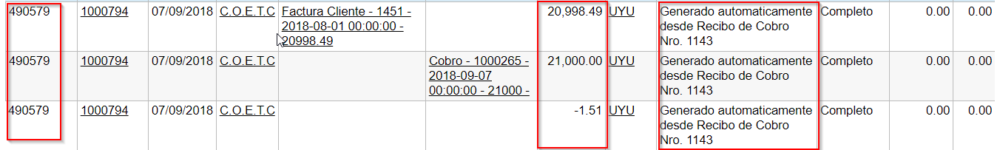
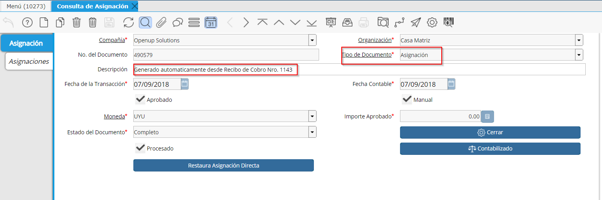
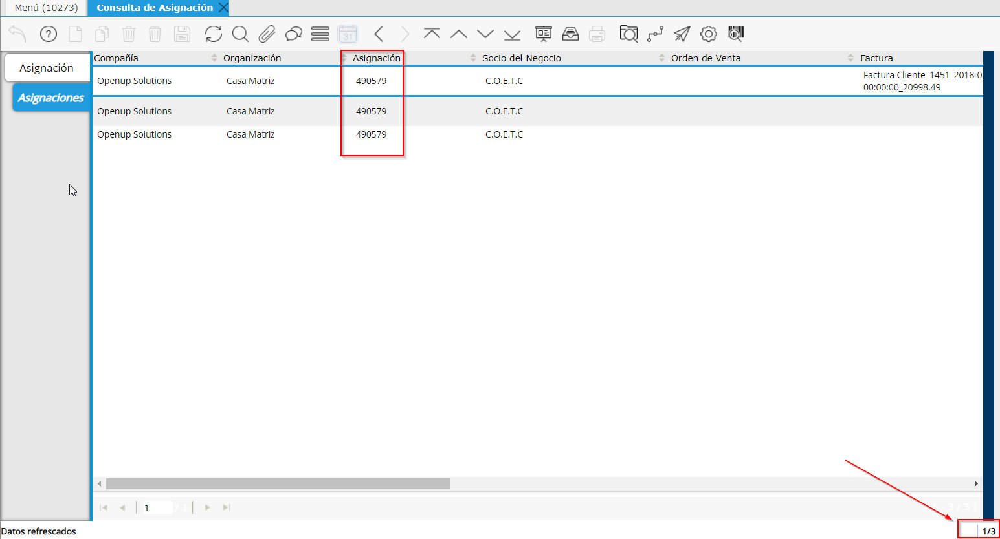
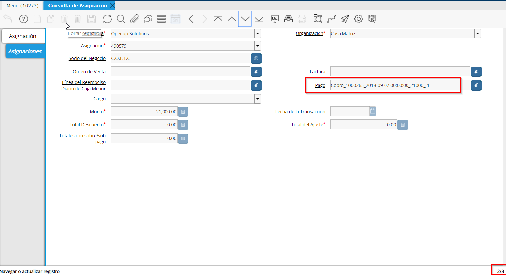
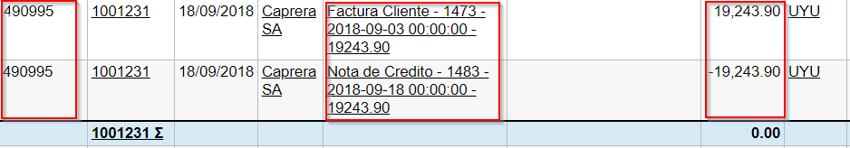
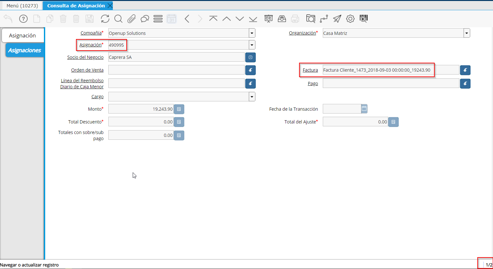

.. |Asignacion Factura Pago Cobro 4| image:: resources/asignacion-factura-pago-cobro-4.png

.. |Asignacion Factura Pago Cobro 6| image:: resources/asignacion-factura-pago-cobro-6.png

**Asignación**
==============

Es un documento que vincula dos o más elementos, de forma que se pueda
tener una trazabilidad perfecta a causa de esta vinculación.

Tipos de Documentos de Asignación
---------------------------------

-  Asignación Factura - Pago/Cobro
-  Asignación Factura - Nota de Crédito
-  Asignación por Anulación
-  Asignación por Documento Diferido

Asignación Factura Pago/Cobro
~~~~~~~~~~~~~~~~~~~~~~~~~~~~~

.. raw:: html

   <table>

.. raw:: html

   <tbody>

.. raw:: html

   <tr>

.. raw:: html

   <td>

Documentos por Cobrar/Pagar

.. raw:: html

   </td>

.. raw:: html

   <td>

.. raw:: html

   

Pago/Cobro

.. raw:: html

   

.. raw:: html

   

Cargo Contable

.. raw:: html

   

.. raw:: html

   </td>

.. raw:: html

   </tr>

.. raw:: html

   </tbody>

.. raw:: html

   </table>

Asignación entre Facturas a Pagar y Pagos o entre Facturas a Cobrar y
Cobros.

La Asignación disminuirá el Saldo Pendiente del Documento por
Pagar/Cobrar.

|Asignacion Factura Pago Cobro 1|

|Asignacion Factura Pago Cobro 2|

|Asignacion Factura Pago Cobro 3|

|Asignacion Factura Pago Cobro 4|

|Asignacion Factura Pago Cobro 5|

|Asignacion Factura Pago Cobro 6|

Asignación por Nota de Crédito
~~~~~~~~~~~~~~~~~~~~~~~~~~~~~~

.. raw:: html

   <table>

.. raw:: html

   <tbody>

.. raw:: html

   <tr>

.. raw:: html

   <td>

Documentos por Cobrar/Pagar

.. raw:: html

   </td>

.. raw:: html

   <td>

Nota de Crédito de Documento por Cobrar/Pagar

.. raw:: html

   </td>

.. raw:: html

   </tr>

.. raw:: html

   </tbody>

.. raw:: html

   </table>

|Asignacion Nota de Credito 1|

|Asignacion Nota de Credito 2|

|Asignacion Nota de Credito 3|

Asignación por Anulación
~~~~~~~~~~~~~~~~~~~~~~~~

.. raw:: html

   <table>

.. raw:: html

   <tbody>

.. raw:: html

   <tr>

.. raw:: html

   <td>

Documentos por Cobrar/Pagar

.. raw:: html

   </td>

.. raw:: html

   <td>

Anulación de  Documento por Cobrar/Pagar

.. raw:: html

   </td>

.. raw:: html

   </tr>

.. raw:: html

   </tbody>

.. raw:: html

   </table>

En cada oportunidad que un documento completo es Anulado el Sistema crea
el Reverso de ese mismo documento y lo asigna mediante este documento.

.. only:: html

    .. figure:: resources/asignacion-por-anulacion.gif

    Video 1. Asignación por Anulación

Asignación por Documento Diferido
~~~~~~~~~~~~~~~~~~~~~~~~~~~~~~~~~

.. raw:: html

   <table>

.. raw:: html

   <tbody>

.. raw:: html

   <tr>

.. raw:: html

   <td>

Documentos por Cobrar/Pagar

.. raw:: html

   </td>

.. raw:: html

   <td>

.. raw:: html

   

Cobro Diferido/Pago Diferido 

.. raw:: html

   

.. raw:: html

   

Contra documento que genera el Pago/Cobro con Cheque diferido

.. raw:: html

   

.. raw:: html

   </td>

.. raw:: html

   </tr>

.. raw:: html

   </tbody>

.. raw:: html

   </table>

Es la que se realiza cuando el Documento a  Pagar / Cobrar se sustituye
por un Documento por Pagar/Cobrar de otro Tipo Diferido (por ejemplo una
Factura se paga o cobra con un Documentos Cheque de Pago/Cobro
Diferido).

De esta manera el saldo del Documento por Pagar/Cobrar  original
(Facturas) disminuye por la sustitución con otro Documento de diferente
Tipo y características, como por ejemplo un Cheque Diferido por Pagar.

El Documento por Pagar (Factura de Proveedor) se sustituye por otro
Documento a  Pagar (Cheque Diferido por Pagar).

El Saldo Abierto del Documento por Pagar que se estará Cancelando con el
documento Pago Diferido.

El Documento por Cobrar (Factura Cliente) se sustituye por otro
Documento a  Cobrar (Cheque Diferido a Cobrar)

.. only:: html

    .. figure:: resources/asignacion-por-documento-diferido.gif

    Video 2. Asignación por Documento Diferido

Asignación Automática de Nota de Crédito
~~~~~~~~~~~~~~~~~~~~~~~~~~~~~~~~~~~~~~~~

Se utilizan los campos en pestaña "CFE Referidos" de "Total Abierto" y
"Total Asignado". Estos campos, cuando las líneas en esta pestaña son
generadas mediante un proceso, se cargan de la siguiente manera:

- Desde botón "Crear Desde" (desde Factura) en cabezal de documento: se
setea el importe abierto de la factura y el importe total asignado,
según el total de líneas agregadas a la nota de crédito.

- Desde proceso "Generar Nota de Crédito desde Factura" (en el ícono del
engranaje en cabezal de factura): se setea el importe abierto de la
factura y el importe total asignado, según el total de líneas agregadas
a la nota de crédito.

- Desde proceso "Generar Nota de Crédito desde Devolución": se setea el
importe abierto de la factura y el importe total asignado se toma del
importe total del cabezal de RMA (Autorización de Devolución)

Si se genera una línea manualmente en pestaña "CFE Referidos", también
se carga el importe abierto, y el importe asignado con igual valor.

Luego, al momento de completarse la NC, se genera la asignación
automática creando una línea por la NC, y las N líneas por cada una de
las facturas presentes en los CFE Referidos, por el importe asignado
indicado en cada una.

Al momento de ejecutarse este proceso, se verifica que cada una de las
facturas siga teniendo un saldo abierto igual o mayor al indicado en la
NC, y también que la moneda sea la misma de la NC, de lo contrario se
retorna mensaje de error indicando el motivo.

CONTROLES:

- No se permite guardar una línea en CFE referidos, si hay una factura
seleccionada y al menos uno de los campos de importe (total abierto o
total asignado) es menor o igual a cero.

- No se permite completar la NC si el monto total de facturas asignadas
es mayor al importe de la NC. En el caso que sea menor, entonces la NC
se asigna con el importe de las facturas asignadas, quedando un
pendiente en la NC.

En ningún caso se toman en cuenta las lineas de CFE referidos que no
tienen factura seleccionada.

**Documentos por Pagar**
------------------------

.. raw:: html

   <table>

.. raw:: html

   <tbody>

.. raw:: html

   <tr>

.. raw:: html

   <td>

Cuenta Contable

.. raw:: html

   </td>

.. raw:: html

   <td>

DEBE

.. raw:: html

   </td>

.. raw:: html

   <td>

HABER

.. raw:: html

   </td>

.. raw:: html

   </tr>

.. raw:: html

   <tr>

.. raw:: html

   <td>

74100 - Tax expense

.. raw:: html

   </td>

.. raw:: html

   <td>

700,00

.. raw:: html

   </td>

.. raw:: html

   <td>

0,00

.. raw:: html

   </td>

.. raw:: html

   </tr>

.. raw:: html

   <tr>

.. raw:: html

   <td>

51400 - Inventory Clearing

.. raw:: html

   </td>

.. raw:: html

   <td>

4.000,00

.. raw:: html

   </td>

.. raw:: html

   <td>

0,00

.. raw:: html

   </td>

.. raw:: html

   </tr>

.. raw:: html

   <tr>

.. raw:: html

   <td>

51400 - Inventory Clearing

.. raw:: html

   </td>

.. raw:: html

   <td>

3.000,00

.. raw:: html

   </td>

.. raw:: html

   <td>

0,00

.. raw:: html

   </td>

.. raw:: html

   </tr>

.. raw:: html

   <tr>

.. raw:: html

   <td>

21100 - Accounts Payable Trade

.. raw:: html

   </td>

.. raw:: html

   <td>

0,00

.. raw:: html

   </td>

.. raw:: html

   <td>

7.700,00

.. raw:: html

   </td>

.. raw:: html

   </tr>

.. raw:: html

   </tbody>

.. raw:: html

   </table>

**Pago (contado)**
------------------

.. raw:: html

   <table>

.. raw:: html

   <tbody>

.. raw:: html

   <tr>

.. raw:: html

   <td>

21300 - Payment selection

.. raw:: html

   </td>

.. raw:: html

   <td>

4.700,00

.. raw:: html

   </td>

.. raw:: html

   <td>

0,00

.. raw:: html

   </td>

.. raw:: html

   </tr>

.. raw:: html

   <tr>

.. raw:: html

   <td>

11110 - Checking In-Transfer

.. raw:: html

   </td>

.. raw:: html

   <td>

0,00

.. raw:: html

   </td>

.. raw:: html

   <td>

4.700,00

.. raw:: html

   </td>

.. raw:: html

   </tr>

.. raw:: html

   </tbody>

.. raw:: html

   </table>

**Cheque Diferido**
-------------------

**Emisión de Cheque**

-  

.. raw:: html

   <table>

.. raw:: html

   <tbody>

.. raw:: html

   <tr>

.. raw:: html

   <td>

CUENTA PUENTE DIFERIDOS

.. raw:: html

   </td>

.. raw:: html

   <td>

3.000,00

.. raw:: html

   </td>

.. raw:: html

   <td>

0,00

.. raw:: html

   </td>

.. raw:: html

   </tr>

.. raw:: html

   <tr>

.. raw:: html

   <td>

Documentos a Pagar Diferidos

.. raw:: html

   </td>

.. raw:: html

   <td>

0,00

.. raw:: html

   </td>

.. raw:: html

   <td>

3.000,00

.. raw:: html

   </td>

.. raw:: html

   </tr>

.. raw:: html

   </tbody>

.. raw:: html

   </table>

**Nota de Crédito Automática.**

-  

.. raw:: html

   <table>

.. raw:: html

   <tbody>

.. raw:: html

   <tr>

.. raw:: html

   <td>

21100 - Accounts Payable Trade

.. raw:: html

   </td>

.. raw:: html

   <td>

3.000,00

.. raw:: html

   </td>

.. raw:: html

   <td>

0,00

.. raw:: html

   </td>

.. raw:: html

   </tr>

.. raw:: html

   <tr>

.. raw:: html

   <td>

CUENTA PUENTE DIFERIDOS

.. raw:: html

   </td>

.. raw:: html

   <td>

0,00

.. raw:: html

   </td>

.. raw:: html

   <td>

3.000,00

.. raw:: html

   </td>

.. raw:: html

   </tr>

.. raw:: html

   </tbody>

.. raw:: html

   </table>

**Asignación de Pagos**
-----------------------

.. raw:: html

   <table>

.. raw:: html

   <tbody>

.. raw:: html

   <tr>

.. raw:: html

   <td>

21100 - Accounts Payable Trade

.. raw:: html

   </td>

.. raw:: html

   <td>

500

.. raw:: html

   </td>

.. raw:: html

   <td>

0,00

.. raw:: html

   </td>

.. raw:: html

   </tr>

.. raw:: html

   <tr>

.. raw:: html

   <td>

21300 - Payment selection

.. raw:: html

   </td>

.. raw:: html

   <td>

0,00

.. raw:: html

   </td>

.. raw:: html

   <td>

500

.. raw:: html

   </td>

.. raw:: html

   </tr>

.. raw:: html

   </tbody>

.. raw:: html

   </table>

**Asignación por Depósito**
~~~~~~~~~~~~~~~~~~~~~~~~~~~

.. raw:: html

   <table>

.. raw:: html

   <tbody>

.. raw:: html

   <tr>

.. raw:: html

   <td>

Cheque Diferido por Cobrar/Pagar

.. raw:: html

   </td>

.. raw:: html

   <td>

Depósito Cheque/ Débito Cheque

.. raw:: html

   </td>

.. raw:: html

   </tr>

.. raw:: html

   </tbody>

.. raw:: html

   </table>

**Asignación Cliente Proveedor**
~~~~~~~~~~~~~~~~~~~~~~~~~~~~~~~~

.. raw:: html

   <table>

.. raw:: html

   <tbody>

.. raw:: html

   <tr>

.. raw:: html

   <td>

Documento por Pagar

.. raw:: html

   </td>

.. raw:: html

   <td>

.. raw:: html

   

Documento por Cobrar

.. raw:: html

   

.. raw:: html

   

Cargo

.. raw:: html

   

.. raw:: html

   </td>

.. raw:: html

   </tr>

.. raw:: html

   </tbody>

.. raw:: html

   </table>

**Asignación Pago Cobro**
~~~~~~~~~~~~~~~~~~~~~~~~~

.. raw:: html

   <table>

.. raw:: html

   <tbody>

.. raw:: html

   <tr>

.. raw:: html

   <td>

Pago

.. raw:: html

   </td>

.. raw:: html

   <td>

.. raw:: html

   

Cobro

.. raw:: html

   

.. raw:: html

   

Cargo

.. raw:: html

   

.. raw:: html

   </td>

.. raw:: html

   </tr>

.. raw:: html

   </tbody>

.. raw:: html

   </table>