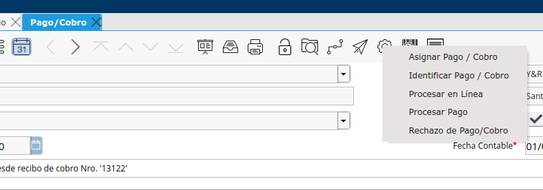
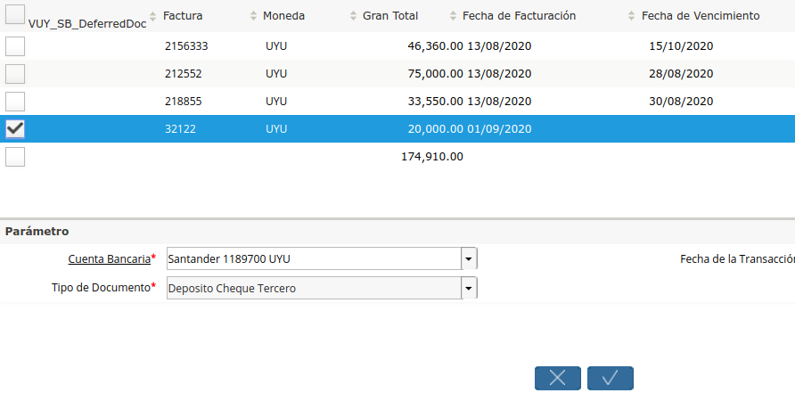

.. |Pestaña Linea Estado Cuentas| image:: resources/linea-estado-cuentas.png

.. |Rechazo de Pago Cobro| image:: resources/proceso-rechazo-de-pago-cobro.png
.. |Rechazado Campo Descripcion| image:: resources/rechazado-campo-descripcion.png

.. |Ventana Cheque Diferido por Cobrar| image:: resources/ventana-cheques-diferidos-por-cobrar.png

**Rechazo de Cheques al Día**
=============================

Para realizar rechazos de Cheques al Día se deberá seguir el siguiente
procedimiento:

-  Realizar el Match entre el Pago/Cobro en cuestión con su línea de
   Conciliación Bancaria correspondiente.
-  Desde el Pago/Cobro que fue rechazado al ingresar al banco se deberá
   correr el proceso de “Rechazo de Pago/Cobro”

|Ventana Pago Cobro|

-  Se deberá seleccionar el tipo de rechazo y definir la fecha del mismo
   y darle OK

|Rechazo de Pago Cobro|

-  Luego de Rechazar el Pago/Cobro en el campo “Descripción se agregará
   el texto “ - RECHAZADO”

|Rechazado Campo Descripcion|

-  Desde la Línea del Estado de Cuenta Bancario se podrá seleccionar el
   Pago/Cobro Rechazado que estará con el Signo contrario del Documento
   Rechazado.

|Pestaña Linea Estado Cuentas|

-  Cobro Rechazado por Cobrar: El cobro en cuestión que quedará
   “Pendiente de Cobrar” se podrá visualizar desde la ventana “Cheques
   Diferidos por Cobrar” pero con el Tipo de Documento “Cheque
   Rechazado”.

|Ventana Cheque Diferido por Cobrar|

-  Para realizar el Cobro del Cheque Rechazado una vez sea abonado por
   el Cliente se deberá utilizar el Smart Browser de Depósito de Cheques
   para que ingrese al banco el nuevo pago correspondiente.

|Sb Deposito de Cheques|