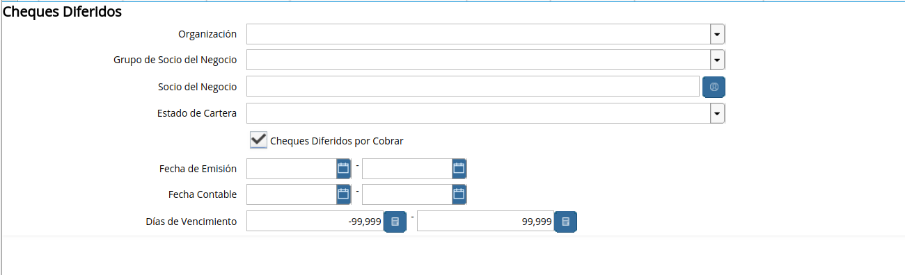
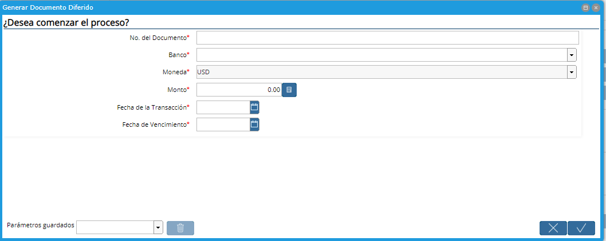

.. |Generar Cheque Diferido| image:: resources/generate-deferred-check.png

**Gestión de Cheques Diferidos por Cobrar**
-------------------------------------------

**Creación de Cheques Diferidos por Cobrar**
~~~~~~~~~~~~~~~~~~~~~~~~~~~~~~~~~~~~~~~~~~~~

Podrá emitir un cheque diferido por Cobrar desde la ventana de Recibo de
Cobro presionando el botón "Generar Cheque Diferido"

|Generar Cheque Diferido|

**Proceso de Generar Cheque Diferido por Cobrar**
^^^^^^^^^^^^^^^^^^^^^^^^^^^^^^^^^^^^^^^^^^^^^^^^^

Deberá ingresar la información del Cheque Diferido a Cobrar que está
recibiendo. Ingrese:

-  Nro. de Documento: Es el número que identifica el Cheque Diferido a
   Cobrar
-  Banco: Es el Banco emisor del cheque. Esta es una lista desplegable,
   por lo que el Banco deberá estar creado.
-  Moneda: Campo de sólo lectura. Es la moneda del Recibo de Cobro
-  Monto: Monto del Cheque
-  Fecha de la Transacción: Es la fecha en que se emitió el cheque. No
   podrá ser anterior a la fecha del recibo.
-  Fecha de Vencimiento: Fecha de vencimiento del Cheque Diferido. No
   podrá ser anterior a la fecha del recibo.
-  Acepte

|Proceso Generar Documento Diferido|

El Cheque Diferido por Cobrar será creado y lo podrá ver en la ventana
de Cheque Diferido por Cobrar.

Los Cheques Diferidos por Cobrar son ingresados al momento de ingresar
el Recibos de Cobro, creándolo en ese mismo momento desde esa ventana.

**Reporte de Cheques Diferidos por Cobrar**
-------------------------------------------

|Reporte Cheques Diferidos por Cobrar|

**Ventana de Cheques Diferidos por Cobrar**
~~~~~~~~~~~~~~~~~~~~~~~~~~~~~~~~~~~~~~~~~~~

Los cheques diferidos por cobrar se visualizan en la ventana “Cheque
Diferido Por Cobrar”.

Esta ventana es solamente de lectura (consulta), ya que los cheques por
cobrar se generan automáticamente desde el recibo de cobro.

El Vencimiento desde la ventana se verá en la Pestaña “Vencimiento”. De
todas maneras la manera más ágil de ver estos vencimientos será mediante
el Reporte de “Cheques Diferidos”.