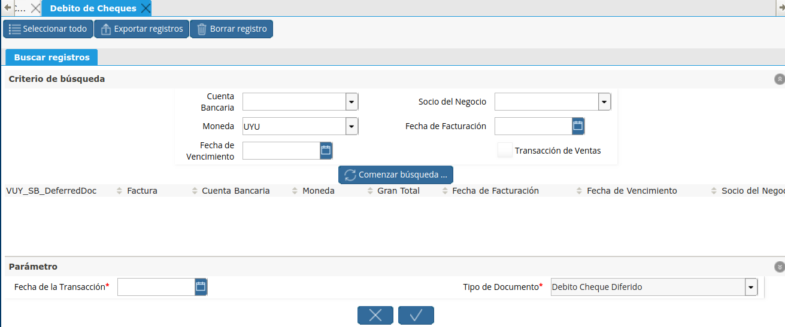

.. |Deposito de Cheque Propio| image:: resources/deposito-de-cheque-propio.png
.. |Documento Generado| image:: resources/documento-generado.png

.. |Seleccionar Lineas| image:: resources/seleccionar-lineas.png

Los Débitos de Cheques Propios se deben realizar mediante el proceso
automatizado de “Débito de Cheques”, el cual representa la salida de
fondos de la empresa a causa del vencimiento de la fecha del cheque
diferido.

La ventaja de utilizar este proceso en vez de la ventana de “Depósito de
Cheque Propio”, es que se pueden hacer los Débitos de una manera mucho
más ágil.

|Proceso Debito de Cheques|

Se permite filtrar los cheques a depositar por socio de negocio, moneda,
fecha de emisión y vencimiento del cheque.

Luego de oprimir el botón “Comenzar Búsqueda”, se cargan automáticamente
en la grilla de abajo los cheques encontrados, pudiendo seleccionar uno
o más. En la parte inferior se deberá indicar la Fecha de transacción
(fecha del depósito) y el Tipo de documento. Para finalizar se confirma
la acción mediante el botón de OK.

|Seleccionar Lineas|

El documento generado por este depósito podrá ser visualizado en la
ventana “Depósito de Cheque Propio”.

|Deposito de Cheque Propio|

A continuación se presenta un ejemplo del procedimiento:

.. only:: html

    .. figure:: resources/gif-debito-de-cheques.gif

    Video 1. Débito de Cheques

Luego veremos el documento generado en la siguiente ventana:

|Documento Generado|