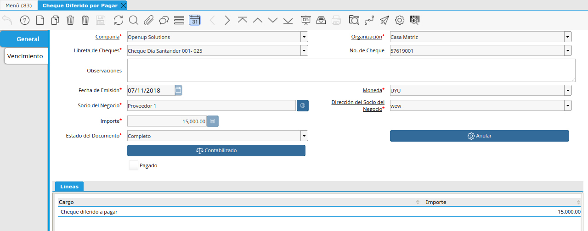

.. |Anular la Emision y Liberar Folio| image:: resource/anular-la-emision-y-liberar-folio.png
.. |Proceso Debito de Cheque| image:: resource/check-debit-process.png
.. |Pestaña Vencimiento Cheque Diferido por Pagar| image:: resource/payment-deferred-check-window-expiration-tab.png

Gestión de Cheques Diferidos por Pagar
======================================

Emisión de Cheque Diferido por Pagar
------------------------------------

Puede emitir un cheque diferido por pagar de dos formas diferentes:

1. Con Proceso desde Recibo de Pago
2. Desde ventana de Cheque Diferido por Pagar

Creación de Cheque Diferido a Pagar desde Recibo de Pago
~~~~~~~~~~~~~~~~~~~~~~~~~~~~~~~~~~~~~~~~~~~~~~~~~~~~~~~~

Podrá generar los cheques recibidos con el botón de la ventana Recibo de
pago.

Creación del/os Cheques desde la Ventana de Cheque Diferido por Pagar
^^^^^^^^^^^^^^^^^^^^^^^^^^^^^^^^^^^^^^^^^^^^^^^^^^^^^^^^^^^^^^^^^^^^^

La emisión de cheques diferidos propios a Pagar se puede realizar
mediante la ventana “Cheque Diferido Por Pagar”.

En el cabezal de la misma se deberá completar los siguientes campos:

-  Libreta: permite elegir de todas las libretas activas en una Cuenta
   Bancaria.
-  Nro. Cheque: permite seleccionar el cheque a emitir, entre todos los
   que aún no han sido emitidos para la  libreta seleccionada.
-  Fecha Emisión: Fecha de emisión del cheque.
-  Socio del Negocio: un cheque siempre deberá ser nominado a un Socio
   de Negocio.
-  Dirección del Socio de Negocio: dirección del socio de negocio
   seleccionado.

Luego, debe ingresar a la pestaña embebida y abrir una “Línea”
accionando Nuevo, clickeando en la línea, se debe ingresar el importe
del cheque (el Cargo aparecerá de manera predeterminada).

Recuerde: Una pestaña embebida está contenida en otra pestaña y es
necesario presionarla para que el sistema cambie el "foco". El indicador
de "foco" es la línea de color en sentido vertical. Cuando cambia el
"foco" cambia la línea vertical.

|Ventana Cheque Diferido por Pagar|

Por último, en la pestaña “Vencimiento” se debe indicar la fecha de
vencimiento y oprimir el botón “Validar” (el check “Válido” deberá
quedar marcado). Para finalizar se procede a Completar el documento.

El Vencimiento desde la ventana se verá en la Pestaña “Vencimiento”. De
todas maneras la manera más ágil de ver estos vencimientos será mediante
el Reporte de “Cheques Diferidos”.

|Pestaña Vencimiento Cheque Diferido por Pagar|

Proceso automático de Debitar los Cheques Diferidos por Pagar
~~~~~~~~~~~~~~~~~~~~~~~~~~~~~~~~~~~~~~~~~~~~~~~~~~~~~~~~~~~~~

De forma automática el sistema diariamente convierte los documentos de
Cheque Diferido por Pagar en un documento día, realizando la aplicación
contable correspondiente.

Débito de Cheques Diferidos Propios a pagar (proceso manual)
^^^^^^^^^^^^^^^^^^^^^^^^^^^^^^^^^^^^^^^^^^^^^^^^^^^^^^^^^^^^

También es posible cambiar el estado de un Cheque Diferido por Pagar de
forma manual mediante el proceso de Débito de Cheques.

Mediante los filtros deberá seleccionar el Cheque Diferido y marcar
aceptar.

|Proceso Debito de Cheque|

El vencimiento de la fecha “diferida” representa la posibilidad salida
de fondos de la empresa a causa del vencimiento de la fecha del cheque
diferido.

Anulación de Cheques Diferidos a Pagar
~~~~~~~~~~~~~~~~~~~~~~~~~~~~~~~~~~~~~~

-  **Anular un Cheque Diferido por Pagar:** Por ejemplo cuando el mismo
   se rompió o consumió el Folio mal escrito, etc. Este proceso debe
   dejar "Consumido" el Nro de la Libreta pero no debe tener ni un
   Importe ni estar contabilizado de ninguna manera.

   -  Para esto existe el proceso "Anular Folio y Consumir Secuencia de
      Cheque", en el cual se debe seleccionar una libreta y el cheque
      que se quiere anular la emisión para volver a generarlo. Al dar OK
      se anulará dicho documento igual que si lo realizara desde la
      ventana pero con la diferencia que además se consumirá el Folio de
      la Libreta de Cheques para que no pueda ser utilizado nuevamente.

-  **Anular la emisión y Liberar Folio:** Por otro lado, puede suceder
   que el error fue sólo en el sistema, y el Folio del Cheque se
   encuentra perfecto por lo que se querrá volver a ingresar de manera
   correcta al sistema. En este caso, si ya completó el Cheque Diferido
   por Pagar se deberá permitir Anular este cheque, y liberar el nro de
   la libreta para que pueda volver a generar el mismo.

   -  Para realizar esta acción simplemente se deberá Anular el
      Documento directo desde la ventana de "Cheques Diferidos por
      Cobrar" o "Cheques Diferidos por Pagar".

|Anular la Emision y Liberar Folio|

.. _section-1:

La ventaja de utilizar este proceso en vez de la ventana de “Depósito de
Cheque Propio”, es que se pueden hacer los Débitos de una manera mucho
más ágil.

Se permite filtrar los cheques a depositar por socio de negocio, moneda,
fecha de emisión y vencimiento del cheque.

Luego de oprimir el botón “Comenzar Búsqueda”, se cargan automáticamente
en la grilla de abajo los cheques encontrados, pudiendo seleccionar uno
o más. En la parte inferior se indica la cuenta bancaria de destino y la
fecha de transacción (fecha del depósito). Para finalizar se confirma la
acción mediante el botón.

El documento generado por este depósito podrá ser visualizado en la
ventana “Débito de Cheque Propio”.