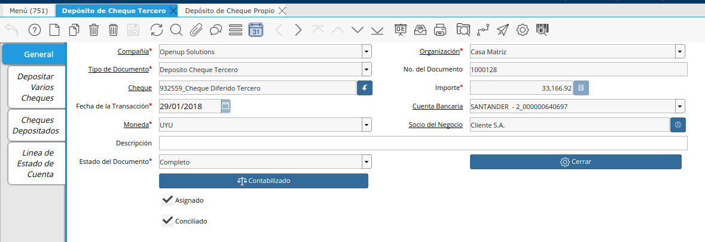

.. |Proceso Deposito de Cheques| image:: resource/check-deposit-process.png

Depósito Cheque Diferido de Clientes (Proceso)
==============================================

Los Depósitos de Cheques de Clientes se deben realizar mediante el
proceso automatizado de “Depósito de Cheques”

La ventaja de utilizar este proceso en vez de la ventana de “Depósito de
Cheque de Tercero”, es que se pueden hacer los depósitos de una manera
mucho más ágil, para diferentes socios de negocio al mismo tiempo.

Permite filtrar los cheques a depositar por socio de negocio, moneda,
fecha de emisión y vencimiento del cheque.

Luego de oprimir el botón “Comenzar Búsqueda”, se cargan automáticamente
en la grilla de abajo los cheques encontrados, pudiendo seleccionar uno
o más. En la parte inferior se indica la cuenta bancaria de destino y la
fecha de transacción (fecha del depósito). Para finalizar se confirma la
acción mediante el botón.

El documento generado por este depósito podrá ser visualizado en la
ventana “Depósito Cheque Tercero”.

Para visualizar la información del Documento generado de Depósito de
Cheque de Tercero se ve desde la ventana “Depósito Cheque Tercero”.

|Ventana Deposito de Cheque Tercero|

Depósito de Cheque Tercero (Documento)
~~~~~~~~~~~~~~~~~~~~~~~~~~~~~~~~~~~~~~

En el cabezal de la Ventana Depósito de Cheque Tercero se verán los
siguientes campos:

Cuenta Bancaria: es la cuenta bancaria de destino (cuenta en la que se
hará el depósito)

Fecha de la Transacción: fecha en que se realiza el depósito

Socio del Negocio: socio del negocio del cheque depositado.

Cheque: aquí se busca y selecciona el cheque a depositar. Si se desea
depositar más de un cheque para el mismo socio de negocios, se puede
utilizar la pestaña “Depositar Varios Cheques”.

|Proceso Deposito de Cheques|

En caso de desear también se podrá generar los depósitos directo desde
esta ventana. Para ello se deberá generar un nuevo registro y completar
todos los campos. Para finalizar se procederá a Completar el documento,
y de esa manera quedará realizado el depósito del cheque en la cuenta
bancaria seleccionada.