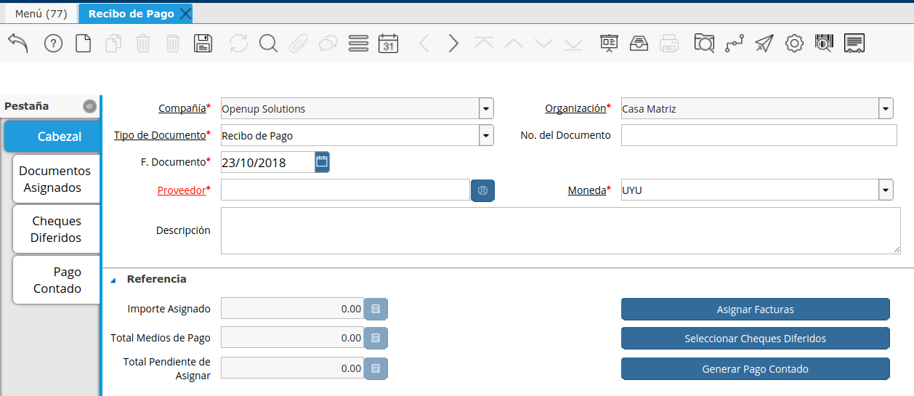
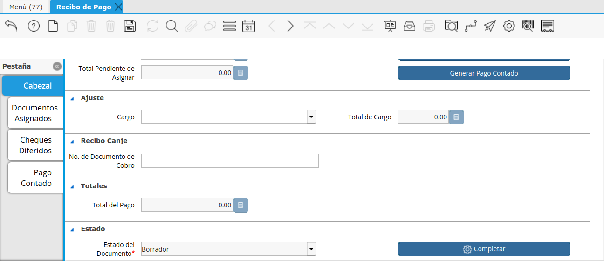

.. |Sb Asignar Factura| image:: resources/smartbrowser-asignar-factura1.png
.. |Ajuste| image:: resources/ajuste.png

**Recibo de Pago**
==================

El recibo de pago opera de manera similar al de Recibo de Cobro.

Para realizar un Recibo de Pago se deberá ingresar a la ventana “Recibo
de Pago”.

|Cabezal|

**Número:** Definir manualmente el Número del Recibo entregado por el
Proveedor, si no lo define el sistema lo definirá automáticamente.

**Proveedor:** donde se deberá ingresar el Proveedor a quién se le está
pagando. **Moneda:** La Moneda del recibo determinará la Moneda que se
entregará el/los Medio de Pago.

**Observaciones:** Observaciones sobre el documento en cuestión.

**Referencia:** Referencia del Documento, se podrá poner la OC  que
corresponde por ejemplo.

Acciones

Asignar Facturas (Documentos por Pagar)
---------------------------------------

Haciendo click en este botón podrá seleccionar directamente qué facturas
se estarán cobrando.

Si la suma de todos los Documentos seleccionados es igual al importe del
Recibo de Cobro se realizará la Asignación correspondiente de manera
automática.

.. raw:: html

   <table>

.. raw:: html

   <tbody>

.. raw:: html

   <tr>

.. raw:: html

   <td>

Si existe una diferencia pero no se selecciona un Cargo, los importes no
cerrarán por lo que no se generará la Asignación automática.

.. raw:: html

   </td>

.. raw:: html

   </tr>

.. raw:: html

   </tbody>

.. raw:: html

   </table>

|Sb Asignar Factura|

Seleccionar Cheque Diferido
---------------------------

En caso de realizar un Pago con un Cheque Diferido se deberá generar el
mismo previamente para luego desde el Recibo de Pago simplemente
seleccionar el mismo.

Generar Pago Contado
--------------------

Definir con qué medio de pago se estará pagando (Contado, Cheque al día
o Transferencia). Así como también el importe del mismo.

Total Medios de Pago: Total de medios de pago asignados al recibo

Importe Asignado: Total de facturas asignadas en el recibo

Total Pendiente de Asignar: Total pendiente de asignar (Monto abierto
del recibo). No puede ser positivo sin tener un Cargo asignado para
saldar la diferencia.

|Cargo|

Ajuste
------

En caso de que exista una diferencia entre los Medios de Pago y los
Documentos a Asignar (redondeo, gastos bancarios por transferencias,
etc) , se podrá aplicar dicha diferencia a un Cargo.

Si existe diferencia y no se selecciona un Cargo, los importes no
equilibrarán exactamente, por lo que no se generará la Asignación
automática.

*Cargo:* Seleccionar entre los cargos definidos el cargo que se desea
aplicar la diferencia.

Importe del Cargo: Diferencia existente entre los Medios de Pago
seleccionados y los Documentos Asignados.

|Ajuste|

**Recibo de Canje**
-------------------

Acción igual a la explicada para Recibos de Cobro.

**Nro de Documento de Pago:** En este campo se podrá definir el Nro de
Recibo de Pago recibido por el Socio del Negocio. En caso de dejar el
campo en blanco se definirá un nro por defecto. Luego se podrá definir
el Nro de Recibo real en el Campo Descripción del Recibo de Pago.

Una vez terminado todos los pasos se deberá completar el documento.