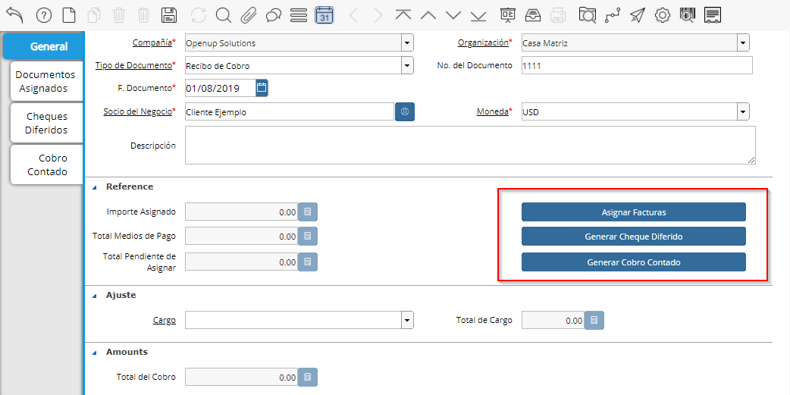
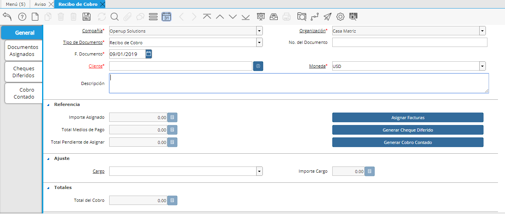
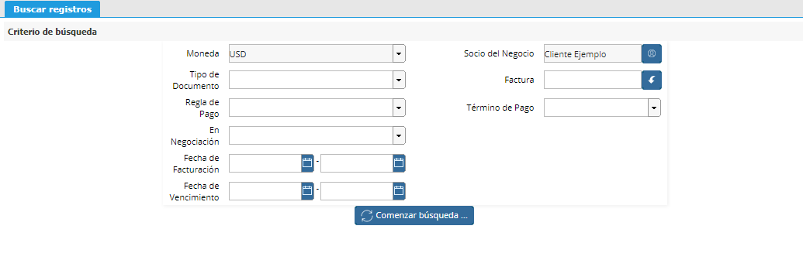

.. |Generar Cobro Contado| image:: resource/generar-cobro-contado.png
.. |Generar Documento Diferido| image:: resource/generar-documento-diferido.png

Recibo de Cobro
---------------

Es un documento que la empresa emite indicando que cobró a un tercero
uno o varios Documentos por Cobrar, indicando qué Documentos está
cobrando y con qué medios de pago le están pagando.

Es un documento emitido por la empresa que relaciona qué está cobrando y
con qué le están pagando.

El recibo de cobro tiene un total monetario que está formado por la suma
de los "Medios de Pago", este total nunca puede exceder el total del
recibo de cobro

El recibo de cobro tiene documentos afectados o "Documentos Por Cobrar",
que pueden afectarse total o parcialmente,  la suma de esta relación
puede ser igual o menor que el Recibo de Cobro pero nunca superior.

Ingreso del Recibo de Cobro una moneda
~~~~~~~~~~~~~~~~~~~~~~~~~~~~~~~~~~~~~~

Para realizar un Recibo de Cobro se deberá ingresar a la ventana llamada
Recibo de Cobro.

|Cabezal|

-  Nro. del Documento: En caso de contar con Libretas de Recibos se
   deberá definir el Nro. del Recibo de manera manual.
-  Cliente: donde se deberá ingresar el cliente a quién se le cobrará.
-  Moneda: La Moneda del recibo determinará la Moneda que se recibirá
   el/los Medio de Pago.
-  Descripción: Observaciones sobre el documento en cuestión.

En la sección Referencia podrá ver datos sobre los importes definidos en
el Recibo. Los campos son los siguientes:

-  Total Medios de Pago: Total de medios de pago asignados al recibo.
-  Importe Asignado: Total de facturas asignadas en el recibo.

Total Pendiente de Asignar: Total pendiente de asignar (Monto abierto
del recibo).

En algunas oportunidades el total de los Documentos por Cobrar no
coinciden con exactitud a los importes recibidos, generando un Importe
sin Asignar. Por ejemplo un redondeo.

En el caso que exista un importe Pendiente de asignar  positivo, se le
deberá asignar un Cargo para saldar la diferencia. Por ejemplo un Cargo
de "Redondeo"

Esto permitirá que el sistema realice la asignación automática.

Acciones
~~~~~~~~

Las acciones que se pueden realizar serán:

-  Asignar facturas
-  Generar Cheques Diferidos
-  Generar Cobro/Pagos Contados

y se deberán realizar con los botones que está en la imagen de abajo.

|Acciones|

1- Asignar Facturas
~~~~~~~~~~~~~~~~~~~

Con el botón Asignar Facturas podrá seleccionar directamente qué
Documentos por Cobrar está cobrando.

Si la suma de todos los Documentos seleccionados es igual al importe del
Recibo de Cobro se realizará la Asignación correspondiente de manera
automática.

|Sb Asignar Factura|

2- Generar Documento de Cobro Diferido
~~~~~~~~~~~~~~~~~~~~~~~~~~~~~~~~~~~~~~

Definir el Cheque Diferido que se está recibiendo. Se deberá definir la
siguiente información: Nro de Cheque, Banco del Cheque, Importe, Fecha
de Emisión y Fecha. Vencimiento.

|Generar Documento Diferido|

3- Generar Cobro Contado
~~~~~~~~~~~~~~~~~~~~~~~~

Seleccionar con qué medio de pago se estará cobrando. Contado, Cheque al
día, cheque diferido, conforme, canje o Transferencia.

|Generar Cobro Contado|

En caso de que exista una diferencia  entre los Medios de Pago y los
Documentos a Asignar, se podrá enviar dicha diferencia a un Cargo.

.. raw:: html

   <table>

.. raw:: html

   <tbody>

.. raw:: html

   <tr>

.. raw:: html

   <td>

Si existe una diferencia pero no se selecciona un Cargo, los importes no
cerrarán por lo que no se generará la Asignación automática.

.. raw:: html

   </td>

.. raw:: html

   </tr>

.. raw:: html

   </tbody>

.. raw:: html

   </table>

Cargo: Seleccionar entre los cargos definidos allí que se desea enviar
la diferencia.

Importe del Cargo: Diferencia existente entre los Medios de Pago
seleccionados y los Documentos Asignados.

Recibo de Canje
~~~~~~~~~~~~~~~

Si dentro del recibo se han ingresado Documentos por Cobrar, pero
también Documentos por Pagar, estos serán sumarizados con signo
contrario para la Asignación de Facturas. Al completar este Recibo estas
Facturas serán Asignadas entre si descontando correctamente el Saldo y
quedando las mismas como Canceladas también.

Opcionalmente podrá definir en el campo "Recibo de Canje" el nro del
Recibo de Canje que en este caso generará de manera automática pero en
la Cuenta Corriente de Cuentas por Pagar con este Socio del Negocio. De
esta manera quedará correctamente representado en ambos estados de
cuenta corriente quedando claro el "Canje" que realizó.

Acciones al Completar un Recibo
~~~~~~~~~~~~~~~~~~~~~~~~~~~~~~~

Al Completar un Recibo de Cobro, se completarán así como los Cobros
definidos en el mismo como también se generará una Asignación entre
todos los documentos definidos en sus pestañas. Será la Asignación el
documento que realmente cancelará el Saldo Abierto de aquellos
Documentos por Cobrar y Documentos por Pagar con sus correspondientes
Pago/Cobro.