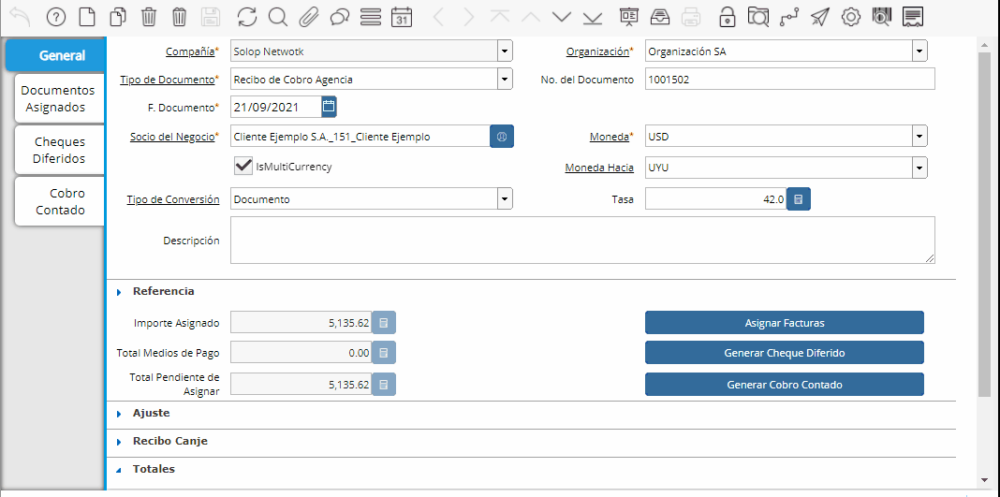

.. |Boton Asignar Facturas| image:: resource/boton-asignar-facturas.png
.. |Gif Cabezal| image:: resource/cabezal.gif

.. |Gif Sb Asignar Facturas| image:: resource/smartbrowser-asignar-facturas-2.gif
.. |Moneda Sb Asignar Facturas| image:: resource/smartbrowser-asignar-facturas.png

Recibo Multimoneda
------------------

Los pasos a seguir para generar un Recibo Multimoneda son los
siguientes:

Acceder a la ventana Recibo de Cobro o Recibo de Pago según corresponda.

En el cabezal deberán definirse los siguientes campos:

-  Tipo de documento
-  Socio de Negocio
-  Moneda (moneda con la que realizó el pago/cobro)
-  Seleccionar el “check multimoneda”
-  En el campo “Moneda hacia” indicaremos la moneda a considerar para
   seleccionar las facturas a asignar, la moneda a la que se convertirá.
-  El campo “Tipo de Conversión”, permitirá seleccionar las opciones
   “Spot”, “Company” o "Documento".

   -  Si elegimos **“Documento”**, podremos elegir la tasa a utilizar,
      la cual será válida sólo para este recibo.
   -  Las otras opciones aquí con “Spot” o “Company” donde se cargaran
      estas tasas en modo “sólo lectura”.

-  Por último el campo “Tasa”, donde definiremos la correspondiente tasa
   manualmente en caso de haber elegido Tipo de conversión: "Documento".

|Gif Cabezal|

Luego seleccionaremos las facturas a asignar mediante el botón “Asignar
facturas”.

|Boton Asignar Facturas|

Se abrirá un Smartbrowser donde seleccionaremos las facturas que se
desean asignar.

En los filtros verá las condiciones por la cuál se filtraran las
facturas, siempre mostrando facturas con saldo abierto.

Aquí por defecto nos trae en el campo “Moneda” la moneda en la que se
cobra o paga, y podemos aplicar además otros filtros que deseemos.

|Moneda Sb Asignar Facturas|

Luego daremos click en “comenzar búsqueda” para correr el proceso de
Smartbrowser.

Elegimos las facturas y en total de pago indicamos el importe a asignar
al Recibo (convertido a la moneda con la que se va a pagar/cobrar).
Luego daremos OK.

|Gif Sb Asignar Facturas|

Por último, generamos el cobro/pago mediante la opción “Generar cheque
diferido” o “Generar pago contado” según corresponda y completaremos el
documento.

|Gif Generar Pago Cobro|