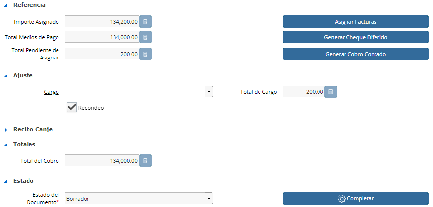
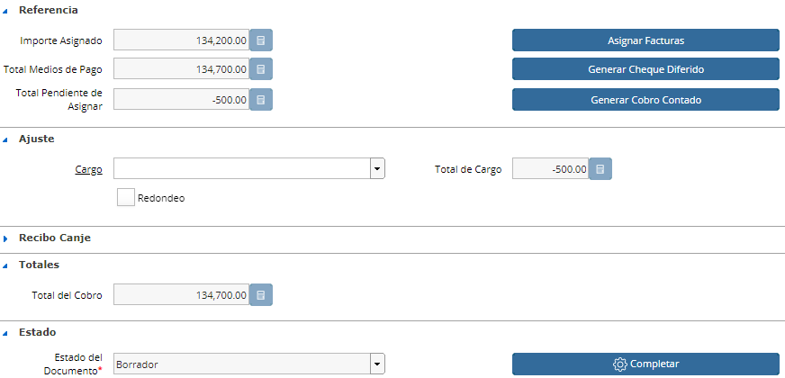
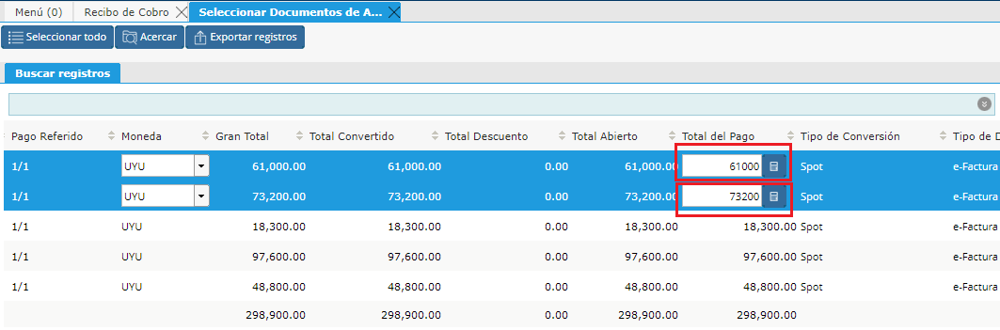

.. |Cabezal Recibo de Cobro| image:: resource/cabezal-recibo-de-cobro.png

.. |Check Redondeo SI| image:: resource/check-redondeo-si.png

Recibo de Cobro con Redondeo
----------------------------

Para generar un  recibo de cobro se comenzará completando los siguientes
campos:

-  Tipo de Documento
-  Socio del Negocio
-  Moneda

|Cabezal Recibo de Cobro|

Luego se procederá a asignar las Facturas y a generar el Cobro.

El Recibo de cobro posee un check de "Redondeo" donde será obligatorio
el importe y se define por defecto el cargo Redondeo.

Si no se marca el check de Redondeo, el importe asignado de Facturas y
el importe asignado de Pago deben ser iguales.

**Pueden existir dos situaciones:**

**COBRO SUPERIOR A FACTURAS (Signo Negativo)**
^^^^^^^^^^^^^^^^^^^^^^^^^^^^^^^^^^^^^^^^^^^^^^

-  Puede ser que la Asignación por importe de Facturas sea menor al
   Cobro y se desee dejar un saldo abierto del Cobro.

En este caso **NO** se deberá marcar el check de Redondeo.

|Check Redondeo NO|

-  La otra opción es Asignar el total del Cobro mandando el resto a un
   Cargo.

Aquí **SI** deberemos marcar el check de Redondeo.

|Check Redondeo SI|

**FACTURAS SUPERIOR AL COBRO (Signo POSITIVO)**
^^^^^^^^^^^^^^^^^^^^^^^^^^^^^^^^^^^^^^^^^^^^^^^

-  **Asignación Parcial:** Para poder hacer una asignación Parcial de
   las Facturas se deberá seleccionar las mismas desde el Smartbrowser
   de Asignar Facturas por el importe que se desea asignar.

|Sb Asignar Facturas|

**El sistema NO PERMITE asignar de más si no se marca el check de
Redondeo.**

-  **Asignación total:** Si se tiene un importe superior de las facturas
   al Cobro, se marca el check "redondeo" y se enviará dicha diferencia
   al Cargo Redondeo.

|Asignacion Total Facturas Superior al Cobro|

Como último paso en todos los casos se deberá Completar el documento
mediante el botón Completar.