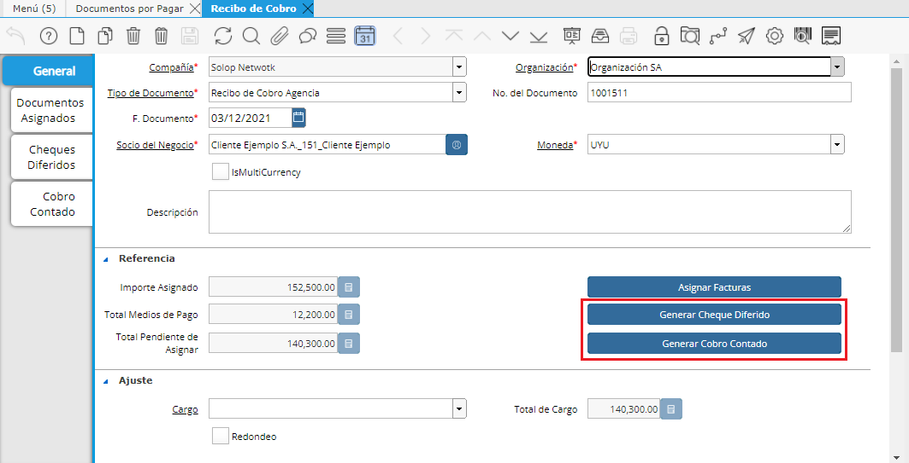

.. |Asignar DxC| image:: resources/asignar-dxc.png
.. |Asignar DxP| image:: resources/asignar-dxp.png
.. |Nro Recibo Canje| image:: resources/campo-recibo-canje.png

.. |Sb Asignar DxC| image:: resources/sb-asignar-dxc.png
.. |Sb Asignar DxP| image:: resources/sb-asignar-dxp.png

**Canje de Recibos (misma moneda)**
~~~~~~~~~~~~~~~~~~~~~~~~~~~~~~~~~~~

| Directamente desde el Recibo se puede generar un Canje de Recibos, ya
  sea desde un Recibo de Cobro como desde un Recibo de Pago. 
| Para realizar el Canje simplemente bastaría Asignar el Documento que
  querría “Canjear” desde el botón Asignar Facturas.

En caso de estar posicionado en un Recibo de Cobro donde se quiere
asignar un **“Documento por Pagar”** para utilizar en modo de “Canje”
simplemente se deberá hacer los **2 procesos** siguientes:

-  **Asignar Facturas de Venta:** Al oprimir el botón “Asignar Facturas”
   de desplegará un  Smart Browser donde podrá filtrar los Documentos a
   ser asignados. En sus Filtros podrá apreciar que se encuentra
   definido por defecto el Socio del Negocio del Recibo así como la
   Moneda del mismo. Además, si está en un Recibo de Cobro, por defecto
   se visualizarán Documentos por Cobrar (Facturas Cliente) que se
   filtran con el check “Transacción de Ventas” en SI.

|Sb Asignar DxC|

|Asignar DxC|

.. only:: html

    .. figure:: resources/gif-asignar-dxc.gif

    Video 1. Asignar Documento por Cobrar

-  **Asignar Facturas de Compra:** si desea seleccionar “Documentos por
   Pagar” para Canjear deberá desmarcar el Check “Transacción de Ventas”
   en “N”. De esta manera al aplicar la búsqueda se desplegarán todos
   los Documentos por Pagar que tengan saldo abierto del Socio de
   Negocio en cuestión.

|Sb Asignar DxP|

|Asignar DxP|

.. only:: html

    .. figure:: resources/gif-asignar-dxp.gif

    Video 2. Asignar Documento por Pagar

-  En caso de que el importe de los Documentos que se desean “Canjear”
   no alcance al importe que se quiere Asignar de Documentos por Cobrar
   se deberá complementar el importe a asignar agregando uno o los
   Medios de Pago que desee de la manera habitual.

|Seleccionar Medio de Pago|

.. only:: html

    .. figure:: resources/gif-generar-cobro.gif

    Video 3. Generar Cobro

-  Luego de terminar de generar todos los Medios de Pago y Documentos a
   ser Asignados, si incluyó Documentos a ser Canjeados en la
   Asignación, el Recibo al ser Completado generará de manera automática
   el Recibo contrario generado mediante el Canje. En este ejemplo
   generará un Recibo de Pago por el importe asignado de los Documentos
   por Pagar asignados. Para definir el Nro de Recibo de Canje, en este
   ejemplo el que sería entregado por el Proveedor, antes de Completar
   el mismo, deberá definir su nro en el campo “Nro de Recibo de Canje”
   para que sea creado correctamente.

|Nro Recibo Canje|

-  Este recibo podrá visualizarse en el Estado de Cuenta del Proveedor
   que está cancelando.

**Nro de Documento de Pago:** En este campo se podrá definir el Nro de
Recibo de Pago recibido por el Socio del Negocio. En caso de dejar el
campo en blanco se definirá un nro por defecto. Luego se podrá definir
el Nro de Recibo real en el Campo Descripción del Recibo de Pago.

Una vez terminado todos los pasos se deberá completar el documento.

**Impresión del Recibo**

En caso de contar con Impresión de Recibos, una vez que esté completo el
Recibo de Cobro aparecerá el botón para imprimir el documento. Dándole
click deberá imprimir el documento correspondiente.