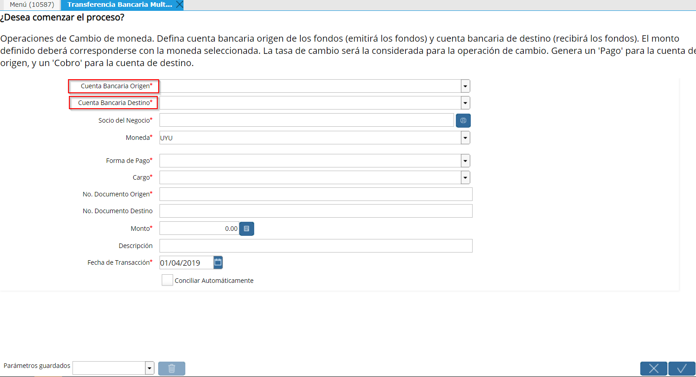

Transferencia Bancaria misma moneda
-----------------------------------

El Proceso de Transferencia Bancaria se utiliza para debitar y acreditar
simultáneamente cuentas bancarias.

Este Proceso crea de manera automática un Pago en la Cuenta Origen (que
emite los fondos) y un Cobro en la Cuenta Destino (que recibe los
fondos).

Estas Transferencias podrán involucrar una misma moneda debitada y
acreditada o puede involucrar 2 monedas, una moneda de Origen y otra
moneda de Destino. Aquí se verá la transferencia de una misma moneda, ya
sea de la moneda esquema de la empresa como de cualquier otra. La
Transferencia de distinta moneda se puede ver en Moneda Extranjera.

Transferencias en la misma moneda
~~~~~~~~~~~~~~~~~~~~~~~~~~~~~~~~~

|Transferencia Bancaria Multimoneda|

-  **Cuenta Bancaria origen:** Cuenta bancaria que emite los fondos
-  **Cuenta Bancaria destino:** Cuenta bancaria que recibe los fondos
-  **Socio de Negocio:** Socio de Negocio involucrado en el origen de la
   transferencia
-  **Moneda:** Moneda de la transferencia
-  **Cargo:** Transferencia
-  **Nro. de Documento:**  Número
-  **Documento destino:** Documento destino
-  **Monto:** Monto transferido
-  **Descripción:** Descripción, si la hubiera
-  **Fecha de la Transacción:** Será también la fecha de contabilización
   de los documentos

En el caso que la transferencia sea en una moneda diferente a la moneda
de la empresa  (Moneda Esquema), el sistema le solicitará también la
Tasa de Cambio.

Es importante destacar que el Cargo determina el asiento contable que
realizará, estipulando la cuenta puente que corresponda, por lo tanto el
Cargo debe ser "Transferencia".