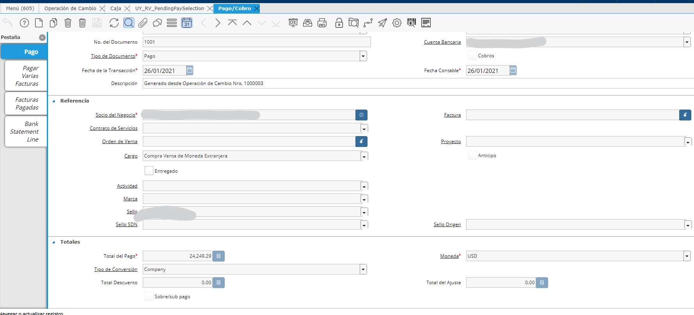

.. |Ventana Operacion de Cambio| image:: resource/exchange-operation.png
.. |Proceso Transferencia Bancaria Multimoneda| image:: resource/multi-currency-transfer-process.png

Transferencia Bancaria Multimoneda
==================================

Desde el proceso "Transferencia Bancaria Multimoneda", se podrá realizar
una transferencia cuando las monedas de la Cuenta Bancaria origen y
Cuenta Bancaria destino son diferentes, es decir, una moneda es la
moneda base y la otra es una moneda extranjera.

Ejemplo: Suponga que requiere realizar una transferencia entre dos
cuentas propias del mismo banco de diferente moneda, el monto
transferido desde la cuenta USD es USD 1.000 y recibira la cuenta de
moneda local UYU $ 30.000.

Desde el proceso de Transferencia Bancaria Multimoneda:

|Proceso Transferencia Bancaria Multimoneda|

La transferencia realiza un Pago de la cuenta bancaria "origen" y un
Cobro de la cuenta bancaria "destino".

Esta operación debitará la cuenta bancaria USD y acreditará la cuenta
Bancaria en la moneda base.

La elección del cargo "Transferencia", determinará los asientos
contables de compra y venta utilizando la cuenta puente "Diferencia
Compra ME". La diferencia de cambio correspondiente a esta operación
quedará como saldo en dicha cuenta.

Operación de Cambio de Moneda
~~~~~~~~~~~~~~~~~~~~~~~~~~~~~

Para ello se utilizará la ventana Operación de Cambio

|Ventana Operacion de Cambio|

En esta ventana se deberá definir como se desea realizar la compra venta
de moneda extranjera.

Inicialmente solicitará a que tasa se realizará la Compra/Venta, esta
tasa es manual ya que normalmente depende de donde se realice la
transacción por lo que el usuario deberá digitarla.

Emisor: se deberá definir de donde se emitirá el dinero (Salida)
definiendo la Cuenta Bancaria o Caja y la Forma de Pago. Según la Cuenta
definida se definirá automáticamente su moneda

Receptor: se deberá definir en que cuenta bancaria o Caja se recibirá el
dinero así como también la Forma de Pago. Según la Cuenta definida se
definirá automáticamente su moneda

Importe: Se deberá seleccionar los siguientes campos para definir el
importe de esta Compra/Venta de Moneda Extranjera. Para ello se deberá
definir la "Moneda" en que se definirá el importe y el "Monto" de dicho
importe. En base a este importe y según la moneda se aplicará la
conversión automáticamente en el Documento contrario que genere,
utilizando la Tasa de Cambio definida inicialmente en la transacción.

Al completar se generará automáticamente un documento de Pago por el
importe correspondiente al "Emisor" y un Cobro al "Receptor"

En cada Pago/Cobro que se genere se definirá por defecto el Cargo
"Compra/Venta de Moneda Extranjera". Este campo tendrá definida una
cuenta contable donde se utilizará como Puente entre ambas
transferencias (Pago - Cobro), permaneciendo en la misma la Diferencia
de Cambio generada por la Cotización definida contra la Tasa de Cambio
Contable del día.

|Ventana Pago Cobro|

Operación de Cambio de Moneda con Selección de Pagos
~~~~~~~~~~~~~~~~~~~~~~~~~~~~~~~~~~~~~~~~~~~~~~~~~~~~

Opcionalmente también se puede generar una Operación de Cambio pero que
en vez de generar directamente un Pago y un Cobro según los datos
definidos, se generará según los datos una "Selección de Pagos" de
manera que luego el Departamento de Tesorería pueda avalar la
Compra/Venta de los dólares y realizar la transacción desde el Banco.

Para ello será necesario simplemente seleccionar un Tipo de Documento
diferente en la Operación de Cambio.