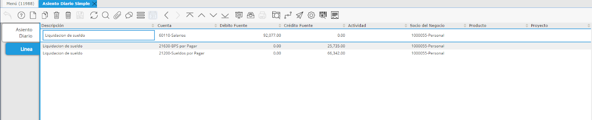

.. |Informacion Contable| image:: resources/accounting-seat-.png
.. |Accion en el Documento| image:: resources/action-on-the-document-.png

**Asiento Diario Simple**
=========================

Cuando desea ingresar un Asiento Diario sin Lote, puede utilizar la
Ventana *Asiento Diario Simple*.

En el cabezal del Asiento tendrá:

**Tipo de Aplicación:** Definir siempre “Actual” para impactar en la
contabilidad normal.

**Tipo de Documento:** Asiento Diario Simple

**No. de Documento:** Automático

**F. Documento:** Definir Fecha de Contabilización del Documento

**Descripción:** detallar lo que se desee del asiento en cuestión a
realizar.

**Período:** se selecciona automáticamente según la Fecha seleccionada.

**Moneda:** Seleccionar Moneda

**Tasa:** Se define automáticamente según la Tasa de cambio del día.

**Total Débito:** Campo Sólo Lectura útil para realizar las
verificaciones del asiento realizado.

**Total Crédito:** Campo Sólo Lectura útil para realizar las
verificaciones del asiento realizado.

**Estado del Documento:**

La información del Asiento la deberá ingresar en la pestaña de Líneas.

Línea a Línea deberá ingresar las líneas del asiento en cuestión,
definiendo los siguientes campos como mínimo:

**Descripción**

**Cuenta Contable**

**Importe**

Podrá visualizar las líneas en Modo Grilla:

|Linea Asiento Diario Simple|

Al completar en la pestaña *Asiento Diario*, podrá hacer clic en
*Contabilizado* y visualizar el asiento contable.

|Informacion Contable|

**Modificando un Asiento de Diario Simple**
-------------------------------------------

Si desea modificar un Asiento ya completo, deberá presionar el botón de
Acciones de Documento, y seleccionar *Reactivar*.

|Accion en el Documento|

Los documentos Reacivados serán borrados.

Ahora podrá modificar el Asiento Contable y Completarlo nuevamente.