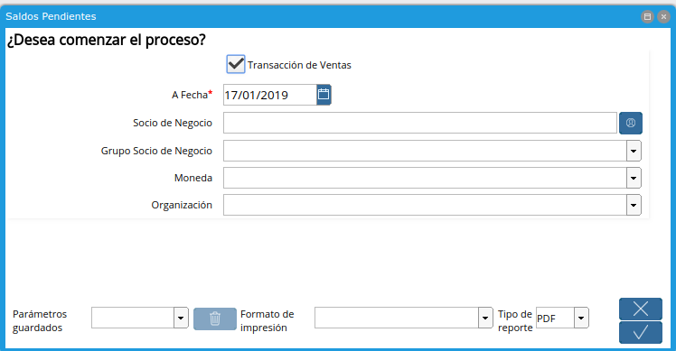
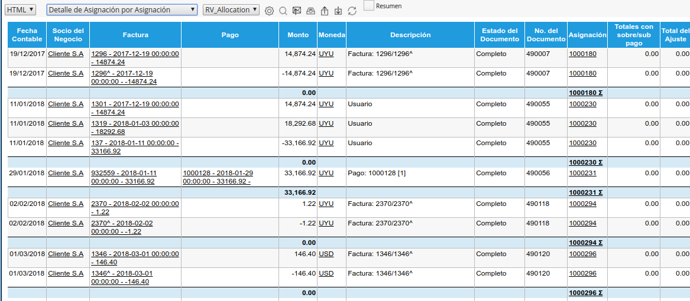

.. |Saldos Pendientes 2| image:: resource/saldos-pendientes-2.png
.. |Estado de Cuenta Corriente 1| image:: resource/estado-de-cuenta-corriente-1.png
.. |Estado de Cuenta Corriente 2| image:: resource/estado-de-cuenta-corriente-2.png
.. |Reporte Asignacion de Pago| image:: resource/reporte-asignacion-de-pago.png

.. |Asignacion por Facturas| image:: resource/asignacion-por-factura.png

Saldos Pendientes
~~~~~~~~~~~~~~~~~

El Reporte de Saldos Pendientes se puede obtener los Documentos que
tienen saldo abierto a una Fecha puntual. El mismo Reporte puede mostrar
o Documentos por Cobrar o Documentos por Pagar, esto será determinado
según se defina el Check “Transacción de Ventas” Y/N.

Podrá filtrar por Socio del negocio, Grupo de Socio del Negocio, Moneda
y Organización.

Si no define ninguna moneda se mostrarán todos los documentos pendientes
agrupados por moneda.

|Saldos Pendientes 1|

|Saldos Pendientes 2|

Estado de Cuenta Corriente
~~~~~~~~~~~~~~~~~~~~~~~~~~

Mediante el Reporte de Estado de Cuenta Corriente podrá visualizar todos
los Documentos generados a un Socio del Negocio dentro de determinado
período de Tiempo y en una Moneda.

|Estado de Cuenta Corriente 1|

|Estado de Cuenta Corriente 2|

Reporte de Asignación de Pago
~~~~~~~~~~~~~~~~~~~~~~~~~~~~~

El Reporte de Asignación de Pago podrá visualizar como es el detalle de
todas las asignaciones generadas a un Socio del Negocio. En dicho
reporte también podrá obtener diferentes vistas sobre la información.

|Reporte Asignacion de Pago|

Asignación por Factura
~~~~~~~~~~~~~~~~~~~~~~

Si desea ver Factura por Factura la asignación correspondiente puede
seleccionar la vista “Detalle de Asignación por Factura”

|Asignacion por Facturas|

.. _section-1:

Asignación de pagos por Asignación
~~~~~~~~~~~~~~~~~~~~~~~~~~~~~~~~~~

Si desea ver por Recibo o por Asignación puede seleccionar la vista
“Detalle de Asignación por Asignación”

|Asignacion de Pagos por Asignacion|